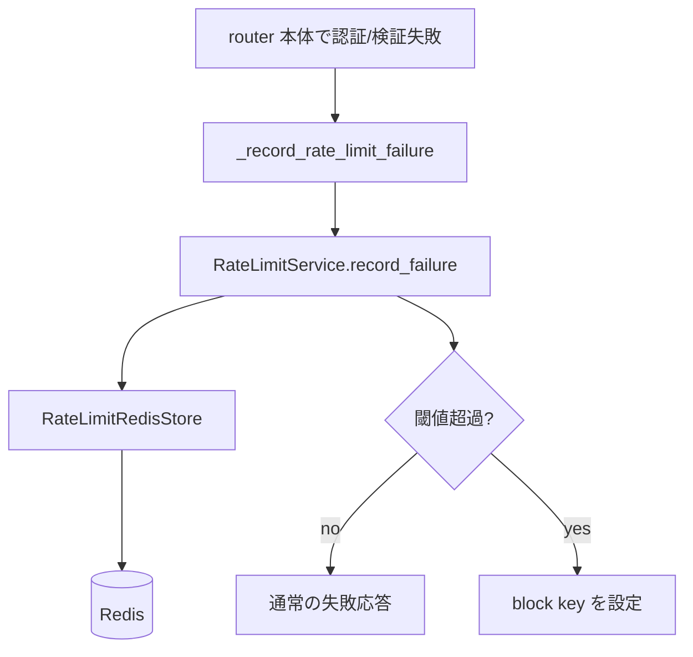
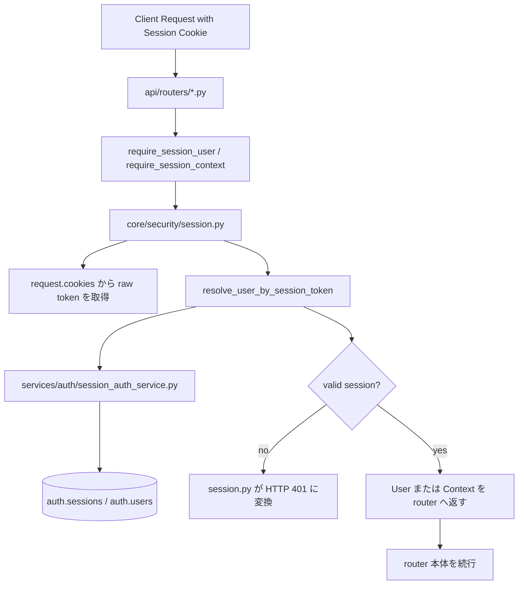
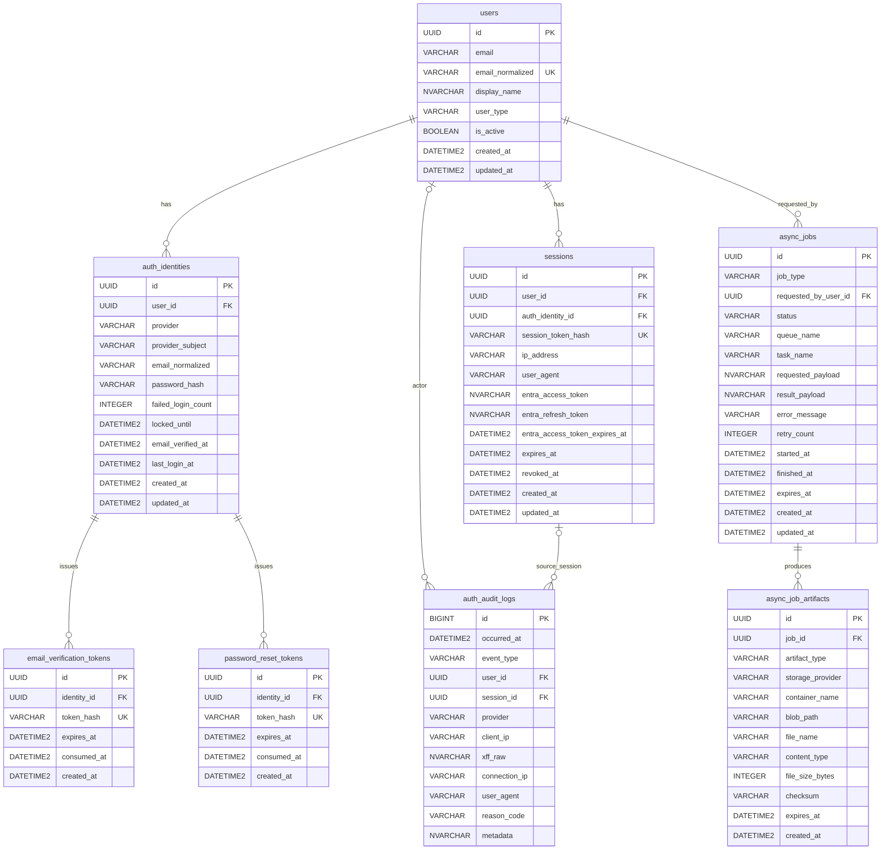

# Backend

`apps/backend` は FastAPI + SQLAlchemy + Alembic を使った backend 実装です。  
認証、監査ログ、非同期ジョブ、cleanup scheduler を 1 つのアプリケーションとして管理します。  
本 README は現行実装をもとにした backend 仕様書を兼ねます。

## 技術スタック

- API: FastAPI
- ORM / Migration: SQLAlchemy, Alembic
- DB: Azure SQL Database
- Auth: Microsoft Entra ID, Email/Password
- Queue: Azure Service Bus
- Storage: Azure Blob Storage
- Package manager: `uv`
- Lint / Typecheck / Test: `ruff`, `pyright`, `pytest`

## 対象範囲

- 認証
  - Microsoft Entra ID 認証
  - Email/Password 認証
  - セッション管理
  - 認証監査ログ
- API プロテクト
  - Cookie セッション
  - CSRF 対策
  - IP ベース rate limit
- 非同期ジョブ
  - Azure Service Bus 連携
  - Azure Blob Storage 成果物保存
  - ジョブ状態管理
  - cleanup

## 実装上の正本

- アプリケーション本体: `apps/backend/app/*`
- DB migration: `apps/backend/alembic/versions/*`
- 設定定義: `apps/backend/app/core/settings/config.py`

## 開発コマンド

- 依存同期: `make backend-install`
- format check: `make backend-format`
- lint: `make backend-lint`
- typecheck: `make backend-typecheck`
- test: `make backend-test`
- migration 生成: `make alembic-revision "message"`
- migration 適用: `make alembic-upgrade`
- API 起動: `make dev-api`
- worker 起動: `make dev-worker`
- worker 個別起動:
  - `make dev-worker-auth-audit-export`
  - `make dev-worker-sample-wait-blob`
- cleanup dry-run:
  - `make schedulers-sessions-dry-run`
  - `make schedulers-audit-dry-run`
  - `make schedulers-jobs-dry-run`

## 初期セットアップ

1. `apps/backend/.env` を用意する  
   `make env`
2. `az login` を済ませる
3. Azure SQL の schema / Entra user / schema 権限を投入する  
   `./scripts/init/sql/deploy.sh -local`
4. Alembic を適用する  
   `make alembic-upgrade`
5. API を起動する  
   `make dev-api`

補足:

- `deploy.sh` は `auth` / `audit` / `core` schema を作成し、現在の `az login` ユーザーを Azure SQL の external user として登録し、各 schema への権限を付与します。
- schema 作成は Alembic ではなく `deploy.sh` の責務です。
- worker が必要な導線は別途 `make dev-worker` を起動します。

## フォルダ構成

```text
apps/backend
├── .env.example                           # backend 用の環境変数サンプル
├── alembic.ini                            # Alembic 実行設定
├── pyproject.toml                         # backend 依存関係と各種ツール設定
├── alembic/                               # DB マイグレーション管理
│   ├── env.py                             # Alembic 実行コンテキスト
│   └── versions/                          # 生成済み migration 履歴
│       └── 6177c957a67e_init_table_schemas.py
└── app/                                   # アプリケーション本体
    ├── main.py                            # FastAPI アプリ生成と router 登録
    ├── api/                               # HTTP インターフェース層
    │   ├── internal/                      # `/livez` `/readyz` など内部運用向け API
    │   │   └── probes.py
    │   ├── routers/                       # エンドポイント定義
    │   │   ├── audit.py                   # 監査ログ API
    │   │   ├── auth.py                    # 認証 API
    │   │   ├── health.py                  # health API
    │   │   └── jobs/                      # 非同期ジョブ API を機能別に分割
    │   │       ├── __init__.py
    │   │       ├── commands.py            # cancel など更新系
    │   │       ├── helpers.py             # 共通認可/変換ヘルパー
    │   │       ├── query.py               # 一覧/詳細/成果物参照
    │   │       └── create/                # job_type ごとの作成 API
    │   └── schemas/                       # Request / Response の Pydantic 定義
    │       ├── audit.py
    │       ├── auth.py
    │       ├── health.py
    │       └── jobs.py
    ├── adapters/                          # 外部サービス接続の抽象化層
    │   ├── cache/                         # Redis client 生成
    │   ├── idp/                           # IdP 連携
    │   ├── network/                       # TCP 到達性確認などの疎通処理
    │   ├── queue/                         # Azure Service Bus 送受信
    │   ├── sql/                           # Azure SQL 接続と access token 注入
    │   └── storage/                       # Azure Blob Storage 入出力
    ├── core/                              # 横断基盤層
    │   ├── lifecycle/                     # startup / shutdown 処理
    │   ├── logging/                       # structlog とアクセスログ設定
    │   ├── security/                      # password / CSRF / API protect / token 暗号化
    │   │   ├── client_ip.py               # trusted proxy 前提の client IP 解決
    │   │   ├── csrf.py                    # Origin/Referer ベース CSRF 保護
    │   │   ├── password.py                # password hash / verify
    │   │   ├── rate_limit/                # Redis ベース IP rate limit
    │   │   │   ├── models.py              # policy / decision などの型
    │   │   │   ├── store.py               # Redis 操作
    │   │   │   ├── service.py             # rate limit 判定
    │   │   │   └── fastapi.py             # FastAPI guard
    │   │   ├── session.py                 # session cookie ベース API protect
    │   │   └── token_cipher.py            # token 暗号化/復号
    │   ├── settings/                      # AppSettings と環境変数解決
    │   └── datetime.py                    # UTC 正規化など共通 utility
    ├── models/                            # SQLAlchemy ORM テーブル定義
    │   ├── audit/                         # 監査ログ系テーブル
    │   ├── auth/                          # 認証・セッション系テーブル
    │   └── jobs/                          # 非同期ジョブ基盤テーブル
    ├── repositories/                      # DB 永続化アクセス層
    │   ├── audit/                         # audit schema 向け query / CRUD
    │   ├── auth/                          # auth schema 向け query / CRUD
    │   └── jobs/                          # core schema 内非同期ジョブ向け query / CRUD
    ├── schedulers/                        # 定期 cleanup CLI と実行単位
    │   ├── scheduler_cleanup.py           # cleanup CLI エントリーポイント
    │   └── cleanup/                       # 対象別 cleanup ロジック
    │       ├── helpers.py
    │       ├── runner_registry.py         # subcommand と runner の対応付け
    │       └── runners/
    ├── services/                          # ユースケース層
    │   ├── audit/                         # 監査ログ記録ユースケース
    │   ├── auth/                          # 認証フロー
    │   └── jobs/                          # job row 作成と queue dispatch
    └── workers/                           # Service Bus worker 実装
        ├── runtime.py                     # 共通 worker 実行ループ
        ├── job_registry.py                # job_type と実行関数の対応表
        ├── entrypoints/                   # worker 起動モジュール
        ├── jobs/                          # 実ジョブ処理本体
        └── messages/                      # Queue メッセージ定義
```

### レイヤ責務

- `api/`: HTTP 入出力、FastAPI router、Pydantic schema
- `services/`: ユースケース、複数 repository を束ねる業務ロジック
- `repositories/`: SQLAlchemy Session を使った CRUD / query
- `models/`: SQLAlchemy ORM テーブル定義
- `adapters/`: Redis / Azure SQL / Service Bus / Blob / Entra などの外部接続
- `workers/`: 非同期ジョブの実行本体
- `schedulers/`: cleanup 系 CLI
- `core/`: 設定、ログ、セキュリティ、共通 utility

## API 構成

公開 API は `/backend` 配下に集約しています。

- `GET /backend/health`
- `GET /backend/auth/me`
- `POST /backend/auth/email/signup`
- `POST /backend/auth/email/verify`
- `POST /backend/auth/email/login`
- `POST /backend/auth/password/reset/request`
- `POST /backend/auth/password/reset/confirm`
- `POST /backend/auth/password/change`
- `GET /backend/auth/entra/login`
- `GET /backend/auth/entra/callback`
- `GET /backend/auth/entra/profile`
- `POST /backend/auth/logout`
- `POST /backend/auth/session/refresh`
- `GET /backend/audit/audit-logs`
- `GET /backend/jobs`
- `GET /backend/jobs/{job_id}`
- `POST /backend/jobs/{job_id}/cancel`
- `GET /backend/jobs/{job_id}/artifacts/{artifact_id}/download`
- `POST /backend/jobs/auth-audit-export`
- `POST /backend/jobs/sample-wait-blob`

内部プローブは `/backend` の外に公開します。

- `GET /livez`
- `GET /readyz`

## 設定仕様

設定は `app/core/settings/config.py` の `AppSettings` に集約しています。  
ローカルでは `apps/backend/.env` があれば読み込み、本番は環境変数注入前提です。

### DB / 接続

- `DATABASE_URL`
- `DATABASE_DEFAULT_PORT`
- `DATABASE_ACCESS_TOKEN_SCOPE`
- `DATABASE_ECHO`
- `DATABASE_POOL_SIZE`
- `DATABASE_MAX_OVERFLOW`
- `DATABASE_POOL_TIMEOUT`

補足:

- 接続ドライバは `pyodbc` 前提です。
- ローカル開発では `az login` と `ODBC Driver 18 for SQL Server` を前提にします。

### セッション / 認証

- `SESSION_COOKIE_NAME`
- `SESSION_COOKIE_SECURE`
- `SESSION_COOKIE_SAMESITE`
- `SESSION_SECRET_KEY`
- `SESSION_TTL_HOURS`
- `SESSION_EXPIRED_GRACE_DAYS`
- `EMAIL_VERIFICATION_TTL_MINUTES`
- `PASSWORD_RESET_TTL_MINUTES`
- `EMAIL_LOGIN_MAX_FAILURES`
- `EMAIL_LOGIN_LOCK_MINUTES`
- `AUTH_DEBUG_RETURN_TOKENS`
- `FRONTEND_BASE_URL`
- `AUTH_POST_LOGIN_DEFAULT_PATH`
- `CSRF_TRUSTED_ORIGINS`
- `ENTRA_TENANT_ID`
- `ENTRA_CLIENT_ID`
- `ENTRA_CLIENT_SECRET`
- `ENTRA_REDIRECT_URI`
- `ENTRA_INTERNAL_DOMAINS`
- `ENTRA_TOKEN_ENCRYPTION_KEY`

### 非同期ジョブ / ストレージ / cleanup

- `ASYNC_JOBS_ENABLED`
- `ASYNC_JOB_MAX_ROWS_PER_JOB`
- `ASYNC_JOB_DEFAULT_RETENTION_DAYS`
- `ASYNC_JOB_RETENTION_MAX_DAYS`
- `ASYNC_JOB_GLOBAL_CONCURRENCY`
- `ASYNC_JOB_PER_USER_CONCURRENCY`
- `ASYNC_JOB_RUNNING_TIMEOUT_SECONDS`
- `SERVICE_BUS_NAMESPACE_FQDN`
- `SERVICE_BUS_USE_CONNECTION_STRING`
- `SERVICE_BUS_CONNECTION_STRING`
- `SERVICE_BUS_AUTH_AUDIT_EXPORT_QUEUE_NAME`
- `ASYNC_JOB_AUTH_AUDIT_EXPORT_TASK_NAME`
- `SERVICE_BUS_SAMPLE_WAIT_BLOB_QUEUE_NAME`
- `ASYNC_JOB_SAMPLE_WAIT_BLOB_TASK_NAME`
- `AZURE_BLOB_ACCOUNT_URL`
- `AZURE_BLOB_CONTAINER`
- `AZURE_BLOB_USE_CONNECTION_STRING`
- `AZURE_BLOB_CONNECTION_STRING`
- `AUTH_AUDIT_RETENTION_MONTHS`
- `SESSION_CLEANUP_ENABLED`
- `AUDIT_CLEANUP_ENABLED`
- `CLEANUP_BATCH_SIZE`

## 認証方針

認証方式は 2 系統です。

- Entra ID: internal ユーザー向け
- Email/Password: external ユーザー向け

主要仕様:

- セッションは DB の `auth.sessions` で管理
- Cookie は `HttpOnly` を利用
- CSRF は `Origin/Referer` 検証ミドルウェアで保護
- 認証系 API には IP ベース rate limit を適用
- パスワードは Argon2id でハッシュ化
- Email verification token / password reset token は SHA-256 ハッシュのみ保存
- Entra の access token / refresh token は暗号化して保存
- `/backend/auth/entra/profile` は internal ユーザーのみ許可

実装上の種別:

- `UserType`
  - `internal`
  - `external`
- `AuthProvider`
  - `entra`
  - `email`

### API Security

設計原則:

1. セキュリティポリシーは `app/core/security` に置く。
2. 認証ドメイン本体は `app/services/auth` に置く。
3. router は HTTP 入出力と `Depends(...)` / guard 呼び出しの接着に限定する。
4. `app/api/dependencies` は使わない。
5. 同じ保護手段を複数 router で使う場合、router helper に重複実装しない。

レイヤ責務:

- `app/core/security`
  - API 保護の共通ルール
  - FastAPI から使う guard
  - client IP 解決
  - session cookie ベース API protect
  - rate limit policy 適用
- `app/services/auth`
  - 認証/セッションのドメイン処理
  - DB を使った user/session 解決
  - 認証失敗をドメインエラーとして返す
- `app/api/routers`
  - route 定義
  - request/response schema の接着
  - `Depends(...)` の適用
  - guard 通過後の業務処理

実装構成:

```text
apps/backend/app/
  core/
    security/
      client_ip.py
      csrf.py
      rate_limit/
        __init__.py
        models.py
        store.py
        service.py
        fastapi.py
      session.py
  services/
    auth/
      session_auth_service.py
  api/
    routers/
      auth.py
      health.py
      audit.py
      jobs/
        helpers.py
        query.py
        commands.py
        create/
```

#### Rate Limit

対象実装:

- `app/core/security/rate_limit/models.py`
- `app/core/security/rate_limit/store.py`
- `app/core/security/rate_limit/service.py`
- `app/core/security/rate_limit/fastapi.py`
- `app/api/routers/auth.py`

モジュール責務:

- `models.py`
  - `RateLimitPolicyKey`、`RateLimitPolicy`、`RateLimitDecision` などの型を持つ。
- `store.py`
  - Redis への読み書きだけを担当する。
  - request counter / failure counter / block key の更新と TTL 管理を行う。
- `service.py`
  - settings から policy を構築する。
  - request/failure を評価し、`RateLimitDecision` を返す。
- `fastapi.py`
  - `Request` から client IP を解決する。
  - `RateLimitService` を呼ぶ。
  - fail-open / observe / enforce を HTTP 応答へ反映する。

router からの利用:

```python
from app.core.security.rate_limit.fastapi import require_rate_limit

@router.post("/email/login")
async def post_email_login(
    ...,
    _: None = Depends(require_rate_limit(RateLimitPolicyKey.EMAIL_LOGIN)),
):
    ...
```

処理フロー:

```mermaid
flowchart TD
    A[Client Request] --> B[api/routers/auth.py]
    B --> C[Depends(require_rate_limit(policy_key))]
    C --> D[core/security/rate_limit/fastapi.py]
    D --> E[resolve_client_ips]
    D --> F[RateLimitService.evaluate_request]
    F --> G[RateLimitRedisStore]
    G --> H[(Redis)]
    F --> I{blocked?}
    I -- no --> J[router 本体を続行]
    I -- observe --> J
    I -- enforce --> K[HTTP 429]
```

処理順:

1. router が `Depends(require_rate_limit(policy_key))` を定義する。
2. `fastapi.py` が `Request` から `client IP` を解決する。
3. `RateLimitService.evaluate_request(...)` が block key を確認する。
4. block 中でなければ `store.py` が request counter を更新する。
5. 閾値超過時は block key を設定し、`RateLimitDecision(blocked=True)` を返す。
6. `observe` mode ではログのみ記録して request は通す。
7. `enforce` mode では `HTTP 429` を返す。
8. request 評価で block されなければ router 本体の処理へ進む。

failure counter の扱い:



補足:

- failure counter の更新は router 本体から明示的に呼ぶ。
- どの API が failure counter を持つかは policy に依存する。
- `app/api/dependencies` は削除済みであり、rate limit dependency は `core/security` に置く。
- `store.py` は役割としては repository 相当だが、security モジュール専用の Redis store として `core/security` 内に置く。

#### Session Protect

対象実装:

- `app/core/security/session.py`
- `app/services/auth/session_auth_service.py`
- `app/api/routers/auth.py`
- `app/api/routers/health.py`
- `app/api/routers/audit.py`
- `app/api/routers/jobs/*`

モジュール責務:

- `session.py`
  - cookie 名の解決
  - raw session token の取得
  - `SessionAuthError -> HTTP 401` 変換
  - `require_session_context`
  - `require_session_user`
  - `require_authenticated_session`
- `session_auth_service.py`
  - session 発行
  - session ローテーション
  - session 失効
  - raw token から有効 session / user を解決

guard 一覧:

- `require_session_context(request, session) -> AuthenticatedSessionContext`
  - user と raw token の両方が必要な endpoint 用
- `require_session_user(request, session) -> User`
  - user だけ取れればよい endpoint 用
- `require_authenticated_session(request, session) -> None`
  - 認証済み確認だけでよい endpoint 用

共通 guard を使う API:

- `GET /backend/auth/me`
- `GET /backend/auth/entra/profile`
- `POST /backend/auth/password/change`
- `GET /backend/health`
- `GET /backend/audit/audit-logs`
- `GET /backend/jobs`
- `GET /backend/jobs/{job_id}`
- `POST /backend/jobs/{job_id}/cancel`
- `GET /backend/jobs/{job_id}/artifacts/{artifact_id}/download`
- `POST /backend/jobs/auth-audit-export`
- `POST /backend/jobs/sample-wait-blob`

補足:

- `POST /backend/auth/logout`
- `POST /backend/auth/session/refresh`

は session cookie を使うが、未認証時の扱いが通常 guard と異なるため、
router 側で `resolve_session_cookie_token(...)` を直接使う。

処理フロー:



処理順:

1. router が `require_session_user(...)` または `require_session_context(...)` を呼ぶ。
2. `session.py` が settings から cookie 名を解決し、raw token を取得する。
3. raw token を `session_auth_service.py` に渡して user を解決する。
4. service は DB 上の session / user を見て有効性を判定する。
5. 無効・期限切れ・user 不在なら `SessionAuthError` を返す。
6. `session.py` がそれを API 用の `401` に変換する。
7. 成功時は `User` または `AuthenticatedSessionContext` を router に返す。
8. router は取得した user/context を使って本体処理だけを続行する。

error 応答:

- session cookie 未設定
  - `HTTP 401`
  - `code: session_missing`
- session invalid / expired / user not found
  - `HTTP 401`
  - `code` は `SessionAuthError.code` をそのまま使う

logout / session refresh の特例:

- `logout`
  - cookie があれば失効を試みる
  - 無効 token でもログアウト成功として扱う
  - browser cookie は常に削除する
- `session/refresh`
  - cookie 未設定時は `session_missing` で `401`
  - 有効 token なら session をローテーションし、新 cookie を発行する

### Auth Rate Limit

認証系 API に適用する IP ベース rate limit の仕様は、上記 `Rate Limit` のうち
認証 API 向けの具体ポリシーを指します。

目的:

- ブルートフォース
- パスワードリセット乱発
- サインアップ乱発
- OIDC callback の過剰試行

を、`client IP + policy_key` 単位で制御する。

対象 API:

- `POST /backend/auth/email/signup`
- `POST /backend/auth/email/login`
- `POST /backend/auth/password/reset/request`
- `POST /backend/auth/password/reset/confirm`
- `GET /backend/auth/entra/login`
- `GET /backend/auth/entra/callback`

非対象:

- `/backend/auth/me`
- `/backend/auth/logout`
- `/backend/auth/session/refresh`
- jobs / audit / health などの認証以外 API

基本方針:

- 既存のアカウント単位ロックを置き換えず、補完する
- 判定単位は `client IP + policy_key`
- 共有ストアに `Azure Managed Redis` を使う
- 複数 Pod 構成でも同一判定になるようにする
- Redis 障害時は `fail-open`

クライアント IP 解決:

- `X-Forwarded-For` を常時信頼しない
- `TRUST_PROXY_HEADERS=true` かつ `TRUSTED_PROXY_CIDRS` に一致する trusted proxy 配下でのみ forward header を採用する
- それ以外は TCP peer address を `client IP` として扱う

補足:

- `TRUSTED_PROXY_CIDRS` は infra 側で Application Gateway サブネット CIDR から生成する

policy 一覧:

| API | policy_key |
| --- | --- |
| `POST /backend/auth/email/signup` | `email_signup` |
| `POST /backend/auth/email/login` | `email_login` |
| `POST /backend/auth/password/reset/request` | `password_reset_request` |
| `POST /backend/auth/password/reset/confirm` | `password_reset_confirm` |
| `GET /backend/auth/entra/login` | `entra_login` |
| `GET /backend/auth/entra/callback` | `entra_callback` |

判定ルール:

- request 時
  - block key を確認する
  - request counter を sliding window で評価する
  - 閾値超過時は block key を設定する
- response/失敗時
  - 必要な API では failure counter を更新する

Redis キー設計:

- namespace
  - `auth:ratelimit`
- request counter
  - `auth:ratelimit:counter:<policy_key>:req:<client_ip>`
- failure counter
  - `auth:ratelimit:counter:<policy_key>:fail:<client_ip>`
- block
  - `auth:ratelimit:block:<policy_key>:<client_ip>`

例:

- `auth:ratelimit:counter:email_login:req:203.0.113.10`
- `auth:ratelimit:counter:email_login:fail:203.0.113.10`
- `auth:ratelimit:block:email_login:203.0.113.10`

Redis データ構造:

- counter
  - Sorted Set
  - score は UNIX epoch milliseconds
- block
  - string key + TTL

TTL 方針:

- counter
  - policy の最長観測窓に合わせる
- block
  - policy ごとの block 秒数をそのまま TTL にする
- 手動解除
  - `block` key 削除で行う

運用方針:

- 標準の手動解除は block key のみ削除する
- counter key は通常削除しない
- ops script
  - [scripts/ops/ip-rate-limit/README.md](/Users/hiroki.ueda/Dev/3pull/scripts/ops/ip-rate-limit/README.md)
- maint-vm 運用時は `mi-[env]-[system]-redis-ops` を利用する

設定項目:

- `RATE_LIMIT_MODE`
- `REDIS_HOST`
- `REDIS_PORT`
- `REDIS_SSL`
- `TRUST_PROXY_HEADERS`
- `TRUSTED_PROXY_CIDRS`
- 各 `RATE_LIMIT_POLICY_*`

補足:

- `RATE_LIMIT_RESPONSE_MESSAGE` は環境変数化しない

検証で確認済みのこと:

- `email/login` で block されること
- `password/reset/request` で block されること
- `email/signup` で block されること
- block TTL 経過で解除されること
- 手動解除で即時解除できること
- Redis 障害時に fail-open で継続すること
- infra から `generated.env.sh` が生成されること

残タスク:

- AKS 上からの実接続確認
- 検証環境での複数 Pod 試験

## データベース設計

アプリケーションテーブルは 3 schema に分割しています。

- `auth`: 認証主体、認証トークン、セッション
- `audit`: 監査ログ
- `core`: 非同期ジョブ基盤

### テーブル一覧

- `auth.users`
- `auth.auth_identities`
- `auth.sessions`
- `auth.email_verification_tokens`
- `auth.password_reset_tokens`
- `audit.auth_audit_logs`
- `core.async_jobs`
- `core.async_job_artifacts`

### 共通方針

- RDBMS は Azure SQL Database を利用する
- 日時型は `datetime2(3)` を利用する
- JSON 可変データは `NVARCHAR(MAX)` に JSON 文字列で保存する
- enum は DB ネイティブ型を使わず、文字列列とアプリ側 `StrEnum` で管理する

### テーブル仕様

#### `auth.users`

- 主キー: `id`（UUID）
- 主な列:
  - `email`
  - `email_normalized`
  - `display_name`
  - `user_type`
  - `is_active`
  - `created_at`
  - `updated_at`
- 制約 / index:
  - `email_normalized` unique
  - `ix_users_is_active`

#### `auth.auth_identities`

- 主キー: `id`（UUID）
- 外部キー: `user_id -> auth.users.id`
- 主な列:
  - `provider`
  - `provider_subject`
  - `email_normalized`
  - `password_hash`
  - `failed_login_count`
  - `locked_until`
  - `email_verified_at`
  - `last_login_at`
  - `created_at`
  - `updated_at`
- 制約 / index:
  - `provider + provider_subject` unique
  - `ix_auth_identities_user_id`
  - `ix_auth_identities_email_normalized`

#### `auth.sessions`

- 主キー: `id`（UUID）
- 外部キー:
  - `user_id -> auth.users.id`
  - `auth_identity_id -> auth.auth_identities.id`
- 主な列:
  - `session_token_hash`
  - `ip_address`
  - `user_agent`
  - `entra_access_token`
  - `entra_refresh_token`
  - `entra_access_token_expires_at`
  - `expires_at`
  - `revoked_at`
  - `created_at`
  - `updated_at`
- 制約 / index:
  - `session_token_hash` unique
  - `ix_sessions_user_id_revoked_at`
  - `ix_sessions_expires_at`

#### `auth.email_verification_tokens`

- 主キー: `id`（UUID）
- 外部キー: `identity_id -> auth.auth_identities.id`
- 主な列:
  - `token_hash`
  - `expires_at`
  - `consumed_at`
  - `created_at`
- 制約 / index:
  - `token_hash` unique
  - `ix_email_verification_tokens_identity_id_consumed_at`

#### `auth.password_reset_tokens`

- 主キー: `id`（UUID）
- 外部キー: `identity_id -> auth.auth_identities.id`
- 主な列:
  - `token_hash`
  - `expires_at`
  - `consumed_at`
  - `created_at`
- 制約 / index:
  - `token_hash` unique
  - `ix_password_reset_tokens_identity_id_consumed_at`

#### `audit.auth_audit_logs`

- 主キー: `id`（BIGINT IDENTITY）
- 外部キー:
  - `user_id -> auth.users.id`
  - `session_id -> auth.sessions.id`
- 主な列:
  - `occurred_at`
  - `event_type`
  - `provider`
  - `client_ip`
  - `xff_raw`
  - `connection_ip`
  - `user_agent`
  - `reason_code`
  - `metadata`
- index:
  - `ix_auth_audit_logs_occurred_at`
  - `ix_auth_audit_logs_event_type_occurred_at`
  - `ix_auth_audit_logs_user_id_occurred_at`
  - `ix_auth_audit_logs_session_id_occurred_at`

実装済みイベント種別:

- `auth.login.success`
- `auth.login.fail`
- `auth.logout.success`
- `auth.logout.fail`
- `auth.session_refresh.success`
- `auth.session_refresh.fail`
- `auth.session_revoke.success`
- `auth.session_revoke.fail`
- `auth.signup.success`
- `auth.signup.fail`
- `auth.email_verify.success`
- `auth.email_verify.fail`
- `auth.password_change.success`
- `auth.password_change.fail`
- `auth.password_reset_request.success`
- `auth.password_reset_request.fail`
- `auth.password_reset_confirm.success`
- `auth.password_reset_confirm.fail`
- `auth.entra_callback.success`
- `auth.entra_callback.fail`
- `auth.entra_profile_fetch.success`
- `auth.entra_profile_fetch.fail`

#### `core.async_jobs`

- 主キー: `id`（UUID）
- 外部キー: `requested_by_user_id -> auth.users.id`
- 主な列:
  - `job_type`
  - `status`
  - `queue_name`
  - `task_name`
  - `requested_payload`
  - `result_payload`
  - `error_message`
  - `retry_count`
  - `started_at`
  - `finished_at`
  - `expires_at`
  - `created_at`
  - `updated_at`
- index:
  - `ix_async_jobs_requested_by_user_id_created_at`
  - `ix_async_jobs_requested_by_user_id_status_job_type`
  - `ix_async_jobs_job_type_status_created_at`
  - `ix_async_jobs_expires_at`

#### `core.async_job_artifacts`

- 主キー: `id`（UUID）
- 外部キー: `job_id -> core.async_jobs.id`
- 主な列:
  - `artifact_type`
  - `storage_provider`
  - `container_name`
  - `blob_path`
  - `file_name`
  - `content_type`
  - `file_size_bytes`
  - `checksum`
  - `expires_at`
  - `created_at`
- index:
  - `ix_async_job_artifacts_job_id_created_at`

### ER 図



## Alembic 方針

- Alembic は `apps/backend/alembic/` で管理
- autogenerate は model 定義を元に実行
- schema 作成は migration に含めず、`scripts/init/sql/deploy.sh` を前提とする

## 非同期ジョブ基盤

### 基本構成

- API は job row を `core.async_jobs` に作成
- API は Service Bus へ `job_id` ベースのメッセージを送信
- worker は DB を正本として job を claim し、状態更新する
- 成果物本体は Blob Storage、メタデータは `core.async_job_artifacts`

### job_type

- `auth_audit_export`
- `sample_wait_blob`

### status

- `queued`
- `running`
- `succeeded`
- `failed`
- `canceled`
- `expired`

### 実行制御

- `queued` ジョブのみ worker が claim して `running` へ遷移する
- 同時実行数制御は DB 上の状態を基準に判定する
- キャンセル API は `POST /backend/jobs/{job_id}/cancel`
- retry 回数は `retry_count` で管理する

### 関連ファイル

- dispatcher: `app/services/jobs/async_job_dispatcher.py`
- worker runtime: `app/workers/runtime.py`
- registry: `app/workers/job_registry.py`
- audit export worker: `app/workers/jobs/audit_export.py`
- sample worker: `app/workers/jobs/sample_wait_blob.py`

## Cleanup scheduler

cleanup は `app.schedulers.scheduler_cleanup` から起動します。

対象:

- `sessions`: 期限切れセッション削除
- `audit`: 監査ログ retention cleanup
- `jobs`: 期限切れ成果物削除、stale `running` ジョブの `failed` 化

対応ファイル:

- `app/schedulers/cleanup/runners/sessions.py`
- `app/schedulers/cleanup/runners/audit_logs.py`
- `app/schedulers/cleanup/runners/async_jobs.py`

## 実装上の注意

- DB の日時列は `DATETIME2(3)` を使用し、Python 側で UTC として扱います
- enum 値は DB 上は文字列で保持し、アプリケーション層の `StrEnum` は定数として使います
- JSON 的な payload / metadata は Azure SQL 上では `NVARCHAR(MAX)` として保存します
- `/backend/health` の依存性キーは `dependencies.sql` です

## 品質確認

backend 単体の確認:

```bash
make backend-format
make backend-lint
make backend-typecheck
make backend-test
```

2026-03 時点では、少なくとも `ruff` / `pyright` / `pytest` は通る状態を基準とします。
