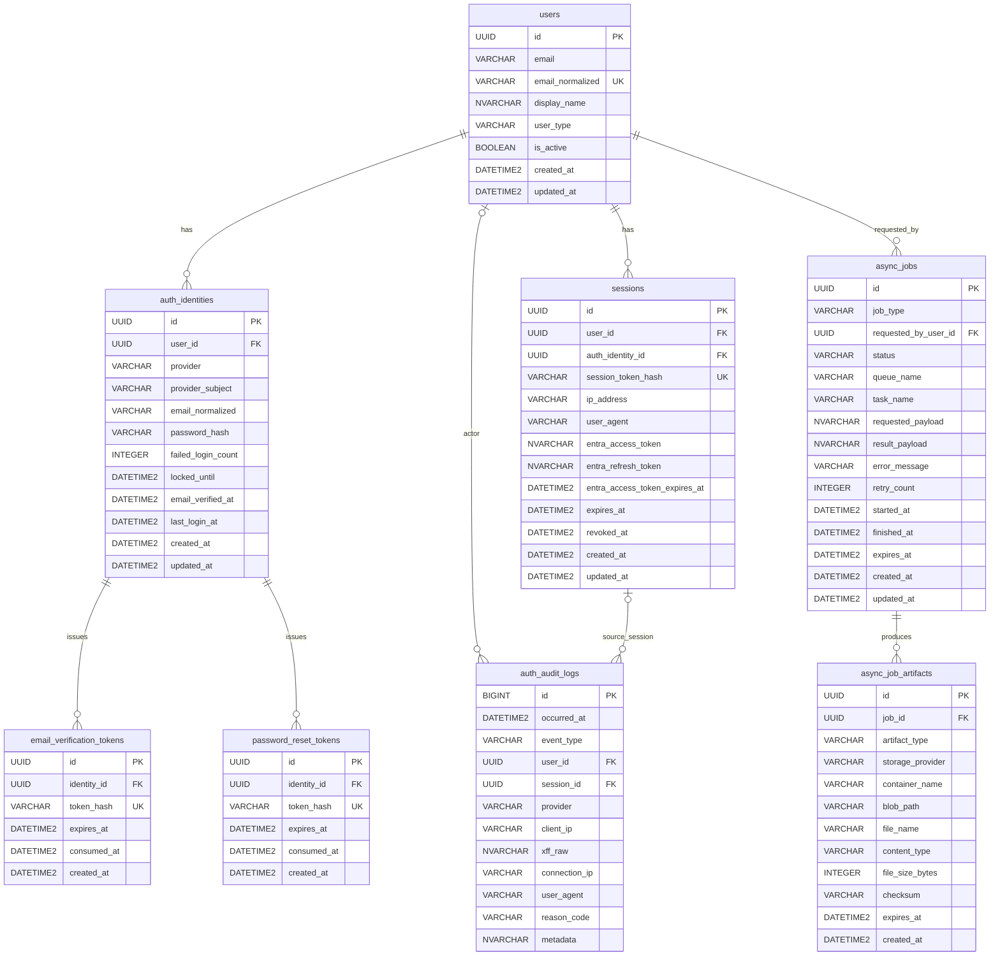

# Backend

`apps/backend` は FastAPI + SQLAlchemy + Alembic を使った backend 実装です。  
認証、監査ログ、非同期ジョブ、cleanup scheduler を 1 つのアプリケーションとして管理します。  
本 README は現行実装をもとにした backend 仕様書を兼ねます。

## 技術スタック

- API: FastAPI
- ORM / Migration: SQLAlchemy, Alembic
- DB: Azure SQL Database
- Cache: Azure Managed Redis
- Auth: Microsoft Entra ID, Email/Password
- Queue: Azure Service Bus
- Storage: Azure Blob Storage
- Package manager: `uv`
- Lint / Typecheck / Test: `ruff`, `pyright`, `pytest`

## 対象範囲

- 認証
  - Microsoft Entra ID 認証
  - Email/Password 認証
  - セッション管理
  - 認証監査ログ
- API プロテクト
  - Cookie セッション
  - CSRF 対策
  - IP ベース rate limit
- 非同期ジョブ
  - Azure Service Bus 連携
  - Azure Blob Storage 成果物保存
  - ジョブ状態管理
  - cleanup

## 実装上の正本

- アプリケーション本体: `apps/backend/app/*`
- DB migration: `apps/backend/alembic/versions/*`
- 設定定義: `apps/backend/app/core/settings/config.py`

## Package Guide

各フォルダの責務や利用方針の詳細は、配下の README を正本として参照します。

- `app/core`
  - [app/core/README.md](/Users/hiroki.ueda/Dev/3pull/apps/backend/app/core/README.md)
- `app/core/logging`
  - [app/core/logging/README.md](/Users/hiroki.ueda/Dev/3pull/apps/backend/app/core/logging/README.md)
- `app/core/lifecycle`
  - [app/core/lifecycle/README.md](/Users/hiroki.ueda/Dev/3pull/apps/backend/app/core/lifecycle/README.md)
- `app/core/settings`
  - [app/core/settings/README.md](/Users/hiroki.ueda/Dev/3pull/apps/backend/app/core/settings/README.md)
- `app/core/security`
  - [app/core/security/README.md](/Users/hiroki.ueda/Dev/3pull/apps/backend/app/core/security/README.md)
- `app/api/routers`
  - [app/api/routers/README.md](/Users/hiroki.ueda/Dev/3pull/apps/backend/app/api/routers/README.md)
- `app/api/internal`
  - [app/api/internal/README.md](/Users/hiroki.ueda/Dev/3pull/apps/backend/app/api/internal/README.md)
- `app/api/schemas`
  - [app/api/schemas/README.md](/Users/hiroki.ueda/Dev/3pull/apps/backend/app/api/schemas/README.md)
- `app/adapters`
  - [app/adapters/README.md](/Users/hiroki.ueda/Dev/3pull/apps/backend/app/adapters/README.md)
- `app/models`
  - [app/models/README.md](/Users/hiroki.ueda/Dev/3pull/apps/backend/app/models/README.md)
- `app/repositories`
  - [app/repositories/README.md](/Users/hiroki.ueda/Dev/3pull/apps/backend/app/repositories/README.md)
- `app/services`
  - [app/services/README.md](/Users/hiroki.ueda/Dev/3pull/apps/backend/app/services/README.md)
- `app/schedulers`
  - [app/schedulers/README.md](/Users/hiroki.ueda/Dev/3pull/apps/backend/app/schedulers/README.md)
- `app/workers`
  - [app/workers/README.md](/Users/hiroki.ueda/Dev/3pull/apps/backend/app/workers/README.md)

## 開発コマンド

- 依存同期: `make backend-install`
- format check: `make backend-format`
- lint: `make backend-lint`
- typecheck: `make backend-typecheck`
- test: `make backend-test`
- migration 生成: `make alembic-revision "message"`
- migration 適用: `make alembic-upgrade`
- API 起動: `make dev-api`
- worker 起動: `make dev-worker`
- worker 個別起動:
  - `make dev-worker-auth-audit-export`
  - `make dev-worker-sample-wait-blob`
- cleanup dry-run:
  - `make schedulers-sessions-dry-run`
  - `make schedulers-audit-dry-run`
  - `make schedulers-jobs-dry-run`

## 初期セットアップ

1. `apps/backend/.env` を用意する  
   `make env`
2. `az login` を済ませる
3. Azure SQL の schema / Entra user / schema 権限を投入する  
   `./scripts/init/sql/deploy.sh -local`
4. Alembic を適用する  
   `make alembic-upgrade`
5. API を起動する  
   `make dev-api`

補足:

- `deploy.sh` は `auth` / `audit` / `core` schema を作成し、現在の `az login` ユーザーを Azure SQL の external user として登録し、各 schema への権限を付与します。
- schema 作成は Alembic ではなく `deploy.sh` の責務です。
- worker が必要な導線は別途 `make dev-worker` を起動します。

## フォルダ構成

```text
apps/backend
├── .env.example                           # backend 用の環境変数サンプル
├── alembic.ini                            # Alembic 実行設定
├── pyproject.toml                         # backend 依存関係と各種ツール設定
├── alembic/                               # DB マイグレーション管理
│   ├── env.py                             # Alembic 実行コンテキスト
│   └── versions/                          # 生成済み migration 履歴
└── app/                                   # アプリケーション本体
    ├── main.py                            # FastAPI アプリ生成と router 登録
    ├── api/                               # HTTP インターフェース層
    │   ├── internal/                      # `/livez` `/readyz` など内部運用向け API
    │   ├── routers/                       # 公開 API の router 定義
    │   └── schemas/                       # Request / Response の Pydantic 定義
    ├── adapters/                          # 外部サービス接続の抽象化層
    │   ├── cache/                         # Redis client 生成
    │   ├── idp/                           # IdP 連携
    │   ├── network/                       # TCP 到達性確認などの疎通処理
    │   ├── queue/                         # Azure Service Bus 送受信
    │   ├── sql/                           # Azure SQL 接続と access token 注入
    │   └── storage/                       # Azure Blob Storage 入出力
    ├── core/                              # 横断基盤層
    │   ├── lifecycle/                     # startup / shutdown 処理
    │   ├── logging/                       # structlog とアクセスログ設定
    │   ├── security/                      # API security と認証用 crypto
    │   │   ├── http/                      # session, csrf, client ip, rate limit
    │   │   └── crypto/                    # password hash, token 暗号化
    │   ├── settings/                      # AppSettings と環境変数解決
    │   └── datetime.py                    # UTC 正規化など共通 utility
    ├── models/                            # SQLAlchemy ORM テーブル定義
    │   ├── audit/                         # audit schema 対応 model
    │   ├── auth/                          # auth schema 対応 model
    │   └── jobs/                          # core schema 内 async jobs 関連 model
    ├── repositories/                      # DB 永続化アクセス層
    │   ├── audit/                         # audit schema 向け query / CRUD
    │   ├── auth/                          # auth schema 向け query / CRUD
    │   └── jobs/                          # core schema 内 async jobs 向け query / CRUD
    ├── schedulers/                        # 定期実行バッチ CLI と実行単位
    │   ├── batch_jobs.py                  # 定期実行バッチ CLI エントリーポイント
    │   └── cleanup/                       # cleanup カテゴリ
    ├── services/                          # ユースケース層
    │   ├── audit/                         # 監査ログ記録ユースケース
    │   ├── auth/                          # 認証フロー
    │   └── jobs/                          # job row 作成と queue dispatch
    └── workers/                           # Service Bus worker 実装
        ├── runtime.py                     # 共通 worker 実行ループ
        ├── job_registry.py                # job_type と実行関数の対応表
        ├── entrypoints/                   # worker 起動モジュール
        ├── jobs/                          # 実ジョブ処理本体
        └── messages/                      # Queue メッセージ定義
```

各レイヤの責務は上記 `Package Guide` の README を参照してください。

## API 構成

公開 API は `/backend` 配下に集約しています。

- `GET /backend/health`
- `GET /backend/auth/me`
- `POST /backend/auth/email/signup`
- `POST /backend/auth/email/verify`
- `POST /backend/auth/email/verify/resend`
- `POST /backend/auth/email/login`
- `POST /backend/auth/password/reset/request`
- `POST /backend/auth/password/reset/confirm`
- `POST /backend/auth/password/change`
- `GET /backend/auth/entra/login`
- `GET /backend/auth/entra/callback`
- `GET /backend/auth/entra/profile`
- `POST /backend/auth/logout`
- `POST /backend/auth/session/refresh`
- `GET /backend/audit/audit-logs`
- `GET /backend/jobs`
- `GET /backend/jobs/{job_id}`
- `POST /backend/jobs/{job_id}/cancel`
- `GET /backend/jobs/{job_id}/artifacts/{artifact_id}/download`
- `POST /backend/jobs/auth-audit-export`
- `POST /backend/jobs/sample-wait-blob`

内部プローブは `/backend` の外に公開します。

- `GET /livez`
- `GET /readyz`

## 設定仕様

設定は `app/core/settings/config.py` の `AppSettings` に集約しています。  
ローカルでは `apps/backend/.env` があれば読み込み、本番は環境変数注入前提です。

### DB / 接続

- `DATABASE_URL`
- `DATABASE_DEFAULT_PORT`
- `DATABASE_ACCESS_TOKEN_SCOPE`
- `DATABASE_ECHO`
- `DATABASE_POOL_SIZE`
- `DATABASE_MAX_OVERFLOW`
- `DATABASE_POOL_TIMEOUT`

補足:

- 接続ドライバは `pyodbc` 前提です。
- ローカル開発では `az login` と `ODBC Driver 18 for SQL Server` を前提にします。

### セッション / 認証

- `SESSION_COOKIE_NAME`
- `SESSION_COOKIE_SECURE`
- `SESSION_COOKIE_SAMESITE`
- `SESSION_SECRET_KEY`
- `SESSION_TTL_HOURS`
- `SESSION_EXPIRED_GRACE_DAYS`
- `EMAIL_VERIFICATION_TTL_MINUTES`
- `PASSWORD_RESET_TTL_MINUTES`
- `EMAIL_LOGIN_MAX_FAILURES`
- `EMAIL_LOGIN_LOCK_MINUTES`
- `AUTH_DEBUG_RETURN_TOKENS`
- `FRONTEND_BASE_URL`
- `AUTH_POST_LOGIN_DEFAULT_PATH`
- `CSRF_TRUSTED_ORIGINS`
- `ENTRA_TENANT_ID`
- `ENTRA_CLIENT_ID`
- `ENTRA_CLIENT_SECRET`
- `ENTRA_REDIRECT_URI`
- `ENTRA_INTERNAL_DOMAINS`
- `ENTRA_TOKEN_ENCRYPTION_KEY`
- `RATE_LIMIT_POLICY_EMAIL_VERIFY_RESEND_WINDOW_SECONDS`
- `RATE_LIMIT_POLICY_EMAIL_VERIFY_RESEND_MAX_REQUESTS`
- `RATE_LIMIT_POLICY_EMAIL_VERIFY_RESEND_BLOCK_SECONDS`

### 非同期ジョブ / ストレージ / cleanup

- `ASYNC_JOBS_ENABLED`
- `ASYNC_JOB_MAX_ROWS_PER_JOB`
- `ASYNC_JOB_DEFAULT_RETENTION_DAYS`
- `ASYNC_JOB_RETENTION_MAX_DAYS`
- `ASYNC_JOB_GLOBAL_CONCURRENCY`
- `ASYNC_JOB_PER_USER_CONCURRENCY`
- `ASYNC_JOB_RUNNING_TIMEOUT_SECONDS`
- `SERVICE_BUS_NAMESPACE_FQDN`
- `SERVICE_BUS_USE_CONNECTION_STRING`
- `SERVICE_BUS_CONNECTION_STRING`
- `SERVICE_BUS_AUTH_AUDIT_EXPORT_QUEUE_NAME`
- `ASYNC_JOB_AUTH_AUDIT_EXPORT_TASK_NAME`
- `SERVICE_BUS_SAMPLE_WAIT_BLOB_QUEUE_NAME`
- `ASYNC_JOB_SAMPLE_WAIT_BLOB_TASK_NAME`
- `AZURE_BLOB_ACCOUNT_URL`
- `AZURE_BLOB_CONTAINER`
- `AZURE_BLOB_USE_CONNECTION_STRING`
- `AZURE_BLOB_CONNECTION_STRING`
- `AUTH_AUDIT_RETENTION_MONTHS`
- `SESSION_CLEANUP_ENABLED`
- `AUDIT_CLEANUP_ENABLED`
- `CLEANUP_BATCH_SIZE`

## 認証方針

認証方式は 2 系統です。

- Entra ID: internal ユーザー向け
- Email/Password: external ユーザー向け

主要仕様:

- セッションは DB の `auth.sessions` で管理
- Cookie は `HttpOnly` を利用
- Cookie の `Secure` / `SameSite` は設定で制御し、既定値は `SESSION_COOKIE_SECURE=true`, `SESSION_COOKIE_SAMESITE=lax`
- CSRF は `Origin/Referer` 検証ミドルウェアで保護
- `CSRF_TRUSTED_ORIGINS` を設定値として持ち、環境ごとに許可 origin を切り替える
- 認証系 API には IP ベース rate limit を適用
- パスワードは Argon2id でハッシュ化
- セッショントークンは生値を保存せず、SHA-256 ハッシュのみを `auth.sessions.session_token_hash` に保存
- セッション refresh 時は旧セッションを失効し、新しいセッションを再発行する
- Email verification token / password reset token は SHA-256 ハッシュのみ保存
- Entra の access token / refresh token は暗号化して保存
- `/backend/auth/entra/profile` は internal ユーザーのみ許可

### Email signup / verify フロー

- `POST /backend/auth/email/signup`
  - 新規 Email account を作成し、`verification_required` を返す。
  - 未検証の同一 Email identity が既に存在する場合は、最新の `password` / `display_name` を採用して継続する。
  - 検証済みの同一 Email identity が存在する場合は `email_account_already_exists` を返す。
  - Entra identity が同一 Email に存在する場合は `entra_account_already_exists` を返す。
- `POST /backend/auth/email/verify`
  - 検証トークンを消費して Email identity を検証済みに更新する。
  - セッション発行は行わない。
- `POST /backend/auth/email/verify/resend`
  - 未検証ユーザー向けに検証メールを再送する。
  - 外向きレスポンスは常に `accepted` を返す。
  - 未検証 identity が存在する場合のみ新しい検証トークンを発行し、既存未消費トークンは失効させる。
  - 対象が存在しない場合、または既に検証済みの場合も外向きレスポンスは同一に保つ。
  - `AUTH_DEBUG_RETURN_TOKENS=true` の場合のみ `debug_verification_token` を返す。
- `POST /backend/auth/email/login`
  - 未検証の場合は `email_not_verified` を返し、フロント側で `verify-email` 導線へ誘導する。

### Frontend との契約

- Email 検証再開の正規導線は `/:lng/verify-email` とする。
- `verify-email` 画面は次を扱う。
  - 検証メール再送
  - 検証トークン入力と検証実行
- `return_to` は相対パスのみ許可し、`login` / `verify-email` 自身へのループは破棄する。
- 検証完了後は自動ログインせず、`/:lng/login` へ戻す。
  - `return_to` がある場合は `/:lng/login?return_to=...` に引き継ぐ。
- `VITE_ENABLE_EMAIL_AUTH=false` の環境では `verify-email` 画面と関連導線を無効化する。

### 監査ログ方針（Email verify resend）

- `auth.email_verify_resend.success`
  - 再送 API の受付成功を記録する。
  - `metadata.email` に対象メールアドレスを記録する。
- `auth.email_verify_resend.fail`
  - 業務状態を握りつぶさない失敗のみを記録する。
  - 存在しない Email や既検証は外向き成功扱いのため、通常は fail ではなく success として扱う。

実装上の種別:

- `UserType`
  - `internal`
  - `external`
- `AuthProvider`
  - `entra`
  - `email`

詳細は各 package README を参照してください。

- API router の責務
  - [app/api/routers/README.md](/Users/hiroki.ueda/Dev/3pull/apps/backend/app/api/routers/README.md)
- API schema の責務
  - [app/api/schemas/README.md](/Users/hiroki.ueda/Dev/3pull/apps/backend/app/api/schemas/README.md)
- security package
  - [app/core/security/README.md](/Users/hiroki.ueda/Dev/3pull/apps/backend/app/core/security/README.md)
- auth service
  - [app/services/README.md](/Users/hiroki.ueda/Dev/3pull/apps/backend/app/services/README.md)

要点だけ整理すると、HTTP 保護は `app.core.security.http`、認証用暗号は `app.core.security.crypto`、認証業務フローは `app.services.auth`、HTTP 入口は `app.api.routers.auth` に分離しています。

## データベース設計

アプリケーションテーブルは 3 schema に分割しています。

- `auth`: 認証主体、認証トークン、セッション
- `audit`: 監査ログ
- `core`: 非同期ジョブ基盤

### テーブル一覧

- `auth.users`
- `auth.auth_identities`
- `auth.sessions`
- `auth.email_verification_tokens`
- `auth.password_reset_tokens`
- `audit.auth_audit_logs`
- `core.async_jobs`
- `core.async_job_artifacts`

### 共通方針

- RDBMS は Azure SQL Database を利用する
- 日時型は `datetime2(3)` を利用する
- JSON 可変データは `NVARCHAR(MAX)` に JSON 文字列で保存する
- enum は DB ネイティブ型を使わず、文字列列とアプリ側 `StrEnum` で管理する

### テーブル仕様

#### `auth.users`

- 主キー: `id`（UUID）
- 主な列:
  - `email`
  - `email_normalized`
  - `display_name`
  - `user_type`
  - `is_active`
  - `created_at`
  - `updated_at`
- 制約 / index:
  - `email_normalized` unique
  - `ix_users_is_active`

#### `auth.auth_identities`

- 主キー: `id`（UUID）
- 外部キー: `user_id -> auth.users.id`
- 主な列:
  - `provider`
  - `provider_subject`
  - `email_normalized`
  - `password_hash`
  - `failed_login_count`
  - `locked_until`
  - `email_verified_at`
  - `last_login_at`
  - `created_at`
  - `updated_at`
- 制約 / index:
  - `provider + provider_subject` unique
  - `ix_auth_identities_user_id`
  - `ix_auth_identities_email_normalized`

#### `auth.sessions`

- 主キー: `id`（UUID）
- 外部キー:
  - `user_id -> auth.users.id`
  - `auth_identity_id -> auth.auth_identities.id`
- 主な列:
  - `session_token_hash`
  - `ip_address`
  - `user_agent`
  - `entra_access_token`
  - `entra_refresh_token`
  - `entra_access_token_expires_at`
  - `expires_at`
  - `revoked_at`
  - `created_at`
  - `updated_at`
- 制約 / index:
  - `session_token_hash` unique
  - `ix_sessions_user_id_revoked_at`
  - `ix_sessions_expires_at`

#### `auth.email_verification_tokens`

- 主キー: `id`（UUID）
- 外部キー: `identity_id -> auth.auth_identities.id`
- 主な列:
  - `token_hash`
  - `expires_at`
  - `consumed_at`
  - `created_at`
- 制約 / index:
  - `token_hash` unique
  - `ix_email_verification_tokens_identity_id_consumed_at`

#### `auth.password_reset_tokens`

- 主キー: `id`（UUID）
- 外部キー: `identity_id -> auth.auth_identities.id`
- 主な列:
  - `token_hash`
  - `expires_at`
  - `consumed_at`
  - `created_at`
- 制約 / index:
  - `token_hash` unique
  - `ix_password_reset_tokens_identity_id_consumed_at`

#### `audit.auth_audit_logs`

- 主キー: `id`（BIGINT IDENTITY）
- 外部キー:
  - `user_id -> auth.users.id`
  - `session_id -> auth.sessions.id`
- 主な列:
  - `occurred_at`
  - `event_type`
  - `provider`
  - `client_ip`
  - `xff_raw`
  - `connection_ip`
  - `user_agent`
  - `reason_code`
  - `metadata`
- index:
  - `ix_auth_audit_logs_occurred_at`
  - `ix_auth_audit_logs_event_type_occurred_at`
  - `ix_auth_audit_logs_user_id_occurred_at`
  - `ix_auth_audit_logs_session_id_occurred_at`

実装済みイベント種別:

- `auth.login.success`
- `auth.login.fail`
- `auth.logout.success`
- `auth.logout.fail`
- `auth.session_refresh.success`
- `auth.session_refresh.fail`
- `auth.session_revoke.success`
- `auth.session_revoke.fail`
- `auth.signup.success`
- `auth.signup.fail`
- `auth.email_verify.success`
- `auth.email_verify.fail`
- `auth.email_verify_resend.success`
- `auth.email_verify_resend.fail`
- `auth.password_change.success`
- `auth.password_change.fail`
- `auth.password_reset_request.success`
- `auth.password_reset_request.fail`
- `auth.password_reset_confirm.success`
- `auth.password_reset_confirm.fail`
- `auth.entra_callback.success`
- `auth.entra_callback.fail`
- `auth.entra_profile_fetch.success`
- `auth.entra_profile_fetch.fail`

#### `core.async_jobs`

- 主キー: `id`（UUID）
- 外部キー: `requested_by_user_id -> auth.users.id`
- 主な列:
  - `job_type`
  - `status`
  - `queue_name`
  - `task_name`
  - `requested_payload`
  - `result_payload`
  - `error_message`
  - `retry_count`
  - `started_at`
  - `finished_at`
  - `expires_at`
  - `created_at`
  - `updated_at`
- index:
  - `ix_async_jobs_requested_by_user_id_created_at`
  - `ix_async_jobs_requested_by_user_id_status_job_type`
  - `ix_async_jobs_job_type_status_created_at`
  - `ix_async_jobs_expires_at`

#### `core.async_job_artifacts`

- 主キー: `id`（UUID）
- 外部キー: `job_id -> core.async_jobs.id`
- 主な列:
  - `artifact_type`
  - `storage_provider`
  - `container_name`
  - `blob_path`
  - `file_name`
  - `content_type`
  - `file_size_bytes`
  - `checksum`
  - `expires_at`
  - `created_at`
- index:
  - `ix_async_job_artifacts_job_id_created_at`

### ER 図



## Alembic 方針

- Alembic は `apps/backend/alembic/` で管理
- autogenerate は model 定義を元に実行
- schema 作成は migration に含めず、`scripts/init/sql/deploy.sh` を前提とする

## 非同期ジョブ基盤

全体の流れは次のとおりです。

- API が job row を `core.async_jobs` に作成する
- API / service が Service Bus へ `job_id` ベースのメッセージを送る
- worker がキューからメッセージを受け取り、DB を正本として job を実行する
- 成果物本体は Blob Storage、メタデータは `core.async_job_artifacts` に保持する

詳細は次を参照してください。

- jobs API の入口
  - [app/api/routers/README.md](/Users/hiroki.ueda/Dev/3pull/apps/backend/app/api/routers/README.md)
- jobs service
  - [app/services/README.md](/Users/hiroki.ueda/Dev/3pull/apps/backend/app/services/README.md)
- workers
  - [app/workers/README.md](/Users/hiroki.ueda/Dev/3pull/apps/backend/app/workers/README.md)
- schedulers
  - [app/schedulers/README.md](/Users/hiroki.ueda/Dev/3pull/apps/backend/app/schedulers/README.md)

## 実装上の注意

- DB の日時列は `DATETIME2(3)` を使用し、Python 側で UTC として扱います
- enum 値は DB 上は文字列で保持し、アプリケーション層の `StrEnum` は定数として使います
- JSON 的な payload / metadata は Azure SQL 上では `NVARCHAR(MAX)` として保存します
- `/backend/health` の依存性キーは `dependencies.sql` です

## 品質確認

backend 単体の確認:

```bash
make backend-format
make backend-lint
make backend-typecheck
make backend-test
```

2026-03 時点では、少なくとも `ruff` / `pyright` / `pytest` は通る状態を基準とします。
