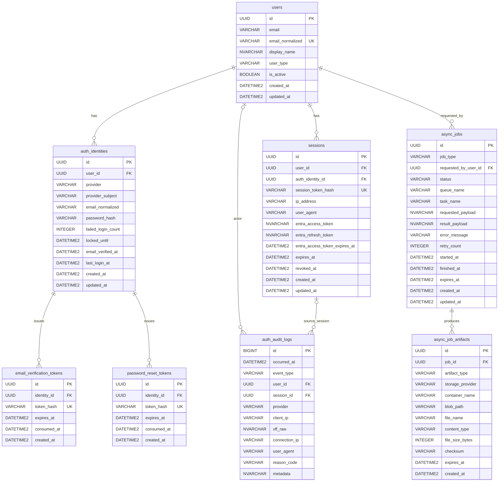

# Backend

`apps/backend` は FastAPI + SQLAlchemy + Alembic を使った backend 実装です。  
認証、監査ログ、非同期ジョブ、cleanup scheduler を 1 つのアプリケーションとして管理します。

## 技術スタック

- API: FastAPI
- ORM / Migration: SQLAlchemy, Alembic
- DB: Azure SQL Database
- Auth: Microsoft Entra ID, Email/Password
- Queue: Azure Service Bus
- Storage: Azure Blob Storage
- Package manager: `uv`
- Lint / Typecheck / Test: `ruff`, `pyright`, `pytest`

## 開発コマンド

- 依存同期: `make backend-install`
- format check: `make backend-format`
- lint: `make backend-lint`
- typecheck: `make backend-typecheck`
- test: `make backend-test`
- migration 生成: `make alembic-revision "message"`
- migration 適用: `make alembic-upgrade`
- API 起動: `make dev-api`
- worker 起動: `make dev-worker`
- worker 個別起動:
  - `make dev-worker-auth-audit-export`
  - `make dev-worker-sample-wait-blob`
- cleanup dry-run:
  - `make schedulers-sessions-dry-run`
  - `make schedulers-audit-dry-run`
  - `make schedulers-jobs-dry-run`

## 初期セットアップ

1. `apps/backend/.env` を用意する  
   `make env`
2. `az login` を済ませる
3. Azure SQL の schema / Entra user / schema 権限を投入する  
   `./scripts/init/sql/deploy.sh -local`
4. Alembic を適用する  
   `make alembic-upgrade`
5. API を起動する  
   `make dev-api`

補足:

- `deploy.sh` は `auth` / `audit` / `core` schema を作成し、現在の `az login` ユーザーを Azure SQL の external user として登録し、各 schema への権限を付与します。
- schema 作成は Alembic ではなく `deploy.sh` の責務です。

## フォルダ構成

```text
apps/backend
├── .env.example                           # backend 用の環境変数サンプル
├── alembic.ini                            # Alembic 実行設定
├── pyproject.toml                         # backend 依存関係と各種ツール設定
├── alembic/                               # DB マイグレーション管理
│   ├── env.py                             # Alembic 実行コンテキスト
│   └── versions/                          # 生成済み migration 履歴
│       └── 6177c957a67e_init_table_schemas.py
└── app/                                   # アプリケーション本体
    ├── main.py                            # FastAPI アプリ生成と router 登録
    ├── api/                               # HTTP インターフェース層
    │   ├── internal/                      # `/livez` `/readyz` など内部運用向け API
    │   │   └── probes.py
    │   ├── routers/                       # エンドポイント定義
    │   │   ├── audit.py                   # 監査ログ API
    │   │   ├── auth.py                    # 認証 API
    │   │   ├── health.py                  # health API
    │   │   └── jobs/                      # 非同期ジョブ API を機能別に分割
    │   │       ├── __init__.py
    │   │       ├── commands.py            # cancel など更新系
    │   │       ├── helpers.py             # 共通認可/変換ヘルパー
    │   │       ├── query.py               # 一覧/詳細/成果物参照
    │   │       └── create/                # job_type ごとの作成 API
    │   └── schemas/                       # Request / Response の Pydantic 定義
    │       ├── audit.py
    │       ├── auth.py
    │       ├── health.py
    │       └── jobs.py
    ├── adapters/                          # 外部サービス接続の抽象化層
    │   ├── idp/                           # IdP 連携
    │   ├── network/                       # TCP 到達性確認などの疎通処理
    │   ├── queue/                         # Azure Service Bus 送受信
    │   ├── sql/                           # Azure SQL 接続と access token 注入
    │   └── storage/                       # Azure Blob Storage 入出力
    ├── core/                              # 横断基盤層
    │   ├── lifecycle/                     # startup / shutdown 処理
    │   ├── logging/                       # structlog とアクセスログ設定
    │   ├── security/                      # password / CSRF / token 暗号化など
    │   ├── settings/                      # AppSettings と環境変数解決
    │   └── datetime.py                    # UTC 正規化など共通 utility
    ├── models/                            # SQLAlchemy ORM テーブル定義
    │   ├── audit/                         # 監査ログ系テーブル
    │   ├── auth/                          # 認証・セッション系テーブル
    │   └── jobs/                          # 非同期ジョブ基盤テーブル
    ├── repositories/                      # DB 永続化アクセス層
    │   ├── audit/                         # audit schema 向け query / CRUD
    │   ├── auth/                          # auth schema 向け query / CRUD
    │   └── jobs/                          # core schema 内非同期ジョブ向け query / CRUD
    ├── schedulers/                        # 定期 cleanup CLI と実行単位
    │   ├── scheduler_cleanup.py           # cleanup CLI エントリーポイント
    │   └── cleanup/                       # 対象別 cleanup ロジック
    │       ├── helpers.py
    │       ├── runner_registry.py         # subcommand と runner の対応付け
    │       └── runners/
    ├── services/                          # ユースケース層
    │   ├── audit/                         # 監査ログ記録ユースケース
    │   ├── auth/                          # 認証フロー
    │   ├── jobs/                          # job row 作成と queue dispatch
    │   └── health.py                      # health 応答の組み立て
    └── workers/                           # Service Bus worker 実装
        ├── runtime.py                     # 共通 worker 実行ループ
        ├── job_registry.py                # job_type と実行関数の対応表
        ├── entrypoints/                   # worker 起動モジュール
        ├── jobs/                          # 実ジョブ処理本体
        └── messages/                      # Queue メッセージ定義
```

### レイヤ責務

- `api/`: HTTP 入出力、FastAPI router、Pydantic schema
- `services/`: ユースケース、複数 repository を束ねる業務ロジック
- `repositories/`: SQLAlchemy Session を使った CRUD / query
- `models/`: SQLAlchemy ORM テーブル定義
- `adapters/`: Azure SQL / Service Bus / Blob / Entra などの外部接続
- `workers/`: 非同期ジョブの実行本体
- `schedulers/`: cleanup 系 CLI
- `core/`: 設定、ログ、セキュリティ、共通 utility

## API 構成

公開 API は `/backend` 配下に集約しています。

- `GET /backend/health`
- `GET /backend/auth/me`
- `POST /backend/auth/email/signup`
- `POST /backend/auth/email/verify`
- `POST /backend/auth/email/login`
- `POST /backend/auth/password/reset/request`
- `POST /backend/auth/password/reset/confirm`
- `POST /backend/auth/password/change`
- `GET /backend/auth/entra/login`
- `GET /backend/auth/entra/callback`
- `GET /backend/auth/entra/profile`
- `POST /backend/auth/logout`
- `POST /backend/auth/session/refresh`
- `GET /backend/audit/audit-logs`
- `GET /backend/jobs`
- `GET /backend/jobs/{job_id}`
- `POST /backend/jobs/{job_id}/cancel`
- `GET /backend/jobs/{job_id}/artifacts/{artifact_id}/download`
- `POST /backend/jobs/auth-audit-export`
- `POST /backend/jobs/sample-wait-blob`

内部プローブは `/backend` の外に公開します。

- `GET /livez`
- `GET /readyz`

## 認証方針

認証方式は 2 系統です。

- Entra ID: internal ユーザー向け
- Email/Password: external ユーザー向け

主要仕様:

- セッションは DB の `auth.sessions` で管理
- Cookie は `HttpOnly` を利用
- CSRF は `Origin/Referer` 検証ミドルウェアで保護
- パスワードは Argon2id でハッシュ化
- Email verification token / password reset token は SHA-256 ハッシュのみ保存
- Entra の access token / refresh token は暗号化して保存
- `/backend/auth/entra/profile` は internal ユーザーのみ許可

## データベース設計

アプリケーションテーブルは 3 schema に分割しています。

- `auth`: 認証主体、認証トークン、セッション
- `audit`: 監査ログ
- `core`: 非同期ジョブ基盤

### テーブル一覧

- `auth.users`
- `auth.auth_identities`
- `auth.sessions`
- `auth.email_verification_tokens`
- `auth.password_reset_tokens`
- `audit.auth_audit_logs`
- `core.async_jobs`
- `core.async_job_artifacts`

### ER 図



## Alembic 方針

- Alembic は `apps/backend/alembic/` で管理
- autogenerate は model 定義を元に実行
- schema 作成は migration に含めず、`scripts/init/sql/deploy.sh` を前提とする

## 非同期ジョブ基盤

### 基本構成

- API は job row を `core.async_jobs` に作成
- API は Service Bus へ `job_id` ベースのメッセージを送信
- worker は DB を正本として job を claim し、状態更新する
- 成果物本体は Blob Storage、メタデータは `core.async_job_artifacts`

### job_type

- `auth_audit_export`
- `sample_wait_blob`

### status

- `queued`
- `running`
- `succeeded`
- `failed`
- `canceled`
- `expired`

### 関連ファイル

- dispatcher: `app/services/jobs/async_job_dispatcher.py`
- worker runtime: `app/workers/runtime.py`
- registry: `app/workers/job_registry.py`
- audit export worker: `app/workers/jobs/audit_export.py`
- sample worker: `app/workers/jobs/sample_wait_blob.py`

## Cleanup scheduler

cleanup は `app.schedulers.scheduler_cleanup` から起動します。

対象:

- `sessions`: 期限切れセッション削除
- `audit`: 監査ログ retention cleanup
- `jobs`: 期限切れ成果物削除、stale `running` ジョブの `failed` 化

対応ファイル:

- `app/schedulers/cleanup/runners/sessions.py`
- `app/schedulers/cleanup/runners/audit_logs.py`
- `app/schedulers/cleanup/runners/async_jobs.py`

## 設定管理

設定は `app/core/settings/config.py` の `AppSettings` に集約しています。  
ローカルでは `apps/backend/.env` があれば読み込み、本番は環境変数注入前提です。

主要設定カテゴリ:

- Azure SQL: `DATABASE_URL`, `DATABASE_*`
- Auth: `SESSION_*`, `EMAIL_*`, `PASSWORD_*`, `ENTRA_*`
- Async jobs: `ASYNC_JOB_*`, `SERVICE_BUS_*`
- Storage: `AZURE_BLOB_*`
- Cleanup: `SESSION_CLEANUP_ENABLED`, `AUDIT_CLEANUP_ENABLED`, `CLEANUP_BATCH_SIZE`

## 実装上の注意

- DB の日時列は `DATETIME2(3)` を使用し、Python 側で UTC として扱います
- enum 値は DB 上は文字列で保持し、アプリケーション層の `StrEnum` は定数として使います
- JSON 的な payload / metadata は Azure SQL 上では `NVARCHAR(MAX)` として保存します
- `/backend/health` の依存性キーは `dependencies.sql` です

## 品質確認

backend 単体の確認:

```bash
make backend-format
make backend-lint
make backend-typecheck
make backend-test
```

2026-03 時点では、少なくとも `ruff` / `pyright` / `pytest` は通る状態を基準とします。
