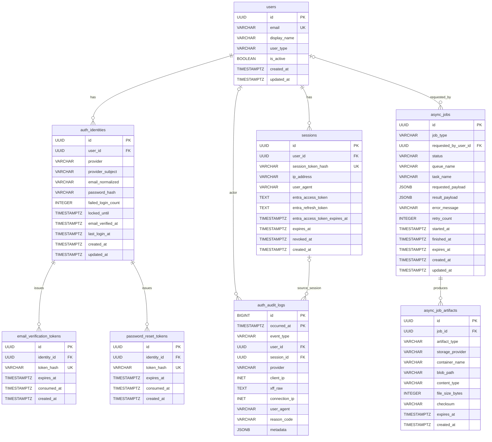

# Backend

## パッケージ管理方針

- `apps/backend` のパッケージ管理は `uv` を標準とします。
- 依存追加・更新・同期は `uv add` / `uv remove` / `uv sync` を利用します。
- ロックファイルは `uv.lock` を正とし、チーム開発では lockfile ベースで再現可能な環境を維持します。

## API フレームワーク方針

- API フレームワークは `FastAPI` を標準採用します。
- エントリーポイントは `apps/backend/app/main.py` とし、`app = FastAPI()` をこのファイルで管理します。
- ルーティング、依存性注入、ミドルウェアなどの API 構成は FastAPI の標準機能を優先して実装します。

### フォルダ構成戦略

- `apps/backend/app/` は「レイヤ責務 + feature 分割」を併用します。
- 実装構成は以下の `tree` を基準とします。

```text
apps/backend
├── pyproject.toml                        # Backend依存関係・ツール設定（ruff/pyright/pytest）
├── alembic.ini                           # Alembic実行設定
├── .env(.example)                        # Backend環境変数定義
├── app/                                  # アプリケーション本体
│   ├── main.py                           # FastAPIブートストラップ（middleware/router登録）
│   ├── api/                              # APIインタフェース層（HTTP入出力）
│   │   ├── routers/                      # エンドポイント定義層
│   │   │   ├── auth.py                   # 認証API
│   │   │   └── jobs/                     # 非同期ジョブAPI（機能別分割）
│   │   │       ├── __init__.py           # jobs ルーター集約
│   │   │       ├── helpers.py            # 共通ヘルパー
│   │   │       ├── query.py              # 参照系（一覧/詳細/成果物DL）
│   │   │       ├── commands.py           # 制御系（キャンセル等）
│   │   │       └── create/               # ジョブ作成API群
│   │   ├── schemas/                      # Request/Responseスキーマ層
│   │   │   ├── auth.py                   # 認証APIスキーマ
│   │   │   └── jobs.py                   # 非同期ジョブAPIスキーマ
│   │   └── internal/                     # 内部運用API層（probe等）
│   ├── adapters/                         # 外部接続層（DB/IdP/Queue/Storage/Network）
│   │   ├── postgres/                     # PostgreSQL接続管理層
│   │   │   ├── base.py                   # SQLAlchemy Declarative Base/metadata定義
│   │   │   └── session.py                # AsyncEngine/Session/UoW依存定義
│   │   ├── queue/                        # Service Bus 接続・送信アダプタ層
│   │   │   ├── service_bus_client.py     # Service Bus sender / receiver 構築
│   │   │   └── message_sender.py         # 非同期ジョブメッセージ送信
│   │   ├── storage/                      # Blob Storage 接続アダプタ層
│   │   │   └── azure_blob.py             # Blob upload / download / delete
│   │   ├── idp/                          # IdP連携層
│   │   │   └── entra.py                  # Entra OIDCクライアント設定/連携
│   │   └── network/                      # ネットワーク疎通アダプタ層
│   │       └── tcp.py                    # TCP pingヘルパー
│   ├── core/                             # 横断基盤層（設定/ログ/セキュリティ/ライフサイクル）
│   │   ├── settings/config.py            # 環境変数設定の一元定義
│   │   ├── logging/config.py             # structlog設定
│   │   ├── security/password.py          # Argon2idパスワード処理
│   │   └── security/csrf.py              # CSRFチェックミドルウェア
│   ├── models/                           # ORMモデル層（テーブル定義）
│   │   ├── auth/                         # 認証機能のモデル群
│   │   └── jobs/                         # 非同期ジョブ基盤のモデル群
│   ├── repositories/                     # 永続化アクセス層（CRUD/クエリ）
│   │   ├── auth/                         # 認証機能のRepository群
│   │   └── jobs/                         # 非同期ジョブ基盤のRepository群
│   ├── schedulers/                       # 定期実行・保守バッチ層（cleanup等）
│   │   ├── scheduler_cleanup.py          # cleanup CLIエントリポイント
│   │   └── cleanup/                      # 対象別 cleanup 実装（sessions/audit/jobs）
│   ├── workers/                          # Service Bus worker 実装
│   │   ├── runtime.py                    # worker共通実行部
│   │   ├── job_registry.py               # job_type と実行関数の対応表
│   │   ├── entrypoints/                  # ジョブ種別ごとの起動スクリプト
│   │   ├── jobs/                         # ジョブ本体実装
│   │   └── messages/                     # queue受信メッセージ定義
│   └── services/                         # ユースケース層（業務ロジック）
│       ├── auth/                         # 認証ユースケース
│       ├── jobs/                         # 非同期ジョブ投入サービス
│       └── health.py                     # ヘルスチェックユースケース
├── alembic/                              # マイグレーション管理層
│   └── versions/                         # 生成されたリビジョンファイル
├── scripts/                              # 初期構築・運用補助スクリプト群
│   ├── postgres/                         # PostgreSQL 初期構築スクリプト群
│   │   ├── run_all.sh                    # DB/Schema/Roleセットアップ実行
│   │   ├── README.md                     # PostgreSQL 初期構築手順
│   │   └── scripts/                      # 個別セットアップスクリプト
│   └── storage/                          # Storage 初期構築スクリプト群
│       ├── create_blob_container.py      # Blob コンテナ作成 CLI
│       └── README.md                     # Storage 初期構築手順
```

- `api/` は HTTP 入出力、`services/` はユースケース、`repositories/` は DB 操作、`models/` は ORM 定義を担当します。
- `adapters/` は外部接続（DB・IdP・Queue・Storage・ネットワーク）を集約し、`core/` は横断関心事（設定/ログ/セキュリティ）を管理します。

## API インタフェース規約

- API のインタフェース定義は `apps/backend/app/api/` 配下に集約します。
- `apps/backend/app/api/routers/` にはエンドポイント定義（HTTP メソッド / パス / ルーター構成）を配置します。
- `apps/backend/app/api/schemas/` にはリクエスト・レスポンスのスキーマ（Pydantic モデル）を配置します。
- 各 API の公開インタフェースは `routers` と `schemas` の組み合わせで定義し、ハンドラ内で直接生の辞書構造を返す実装を避けます。
- `apps/backend/app/main.py` は FastAPI の API ブートストラップとして扱い、アプリ生成・ミドルウェア設定・ルーター登録を担当します。

## 設定管理方針（pydantic-settings）

- アプリ設定の読み込みは `pydantic-settings` を標準採用し、`apps/backend/app/core/settings/config.py` に集約します。
- 設定値は `AppSettings` という 1 つの設定クラスにまとめて定義し、「どの環境変数名から読むか」を各項目ごとに明示します。
- 設定値を使うときは必ず `get_settings()` を使い、毎回作り直さずに同じ設定インスタンスを再利用します。
- ローカル開発時は `apps/backend/.env` が存在する場合のみ `python-dotenv` で読み込み、本番は環境変数注入を前提とします。
- `model_config` では「環境変数の大文字/小文字の違いは厳密に見ない」「未使用の追加環境変数があってもエラーにしない」設定にして、環境ごとの差異で起動失敗しにくくします。

### 設定の利用方法

- ブートストラップ（`apps/backend/app/main.py`）で `get_settings()` を呼び出し、`FastAPI` の title やポートなど起動設定に利用します。
- ライフサイクル（`apps/backend/app/core/lifecycle/startup.py`）で `get_settings()` を呼び出し、ログレベルやサービス名など運用情報の出力に利用します。
- 各モジュールで直接 `os.environ` を読む実装は避け、設定参照は必ず `get_settings()` 経由で統一します。

## ログ出力方針

- アプリケーションログは `structlog` による構造化ログ（JSON）を標準とします。
- ログ関連の実装は `apps/backend/app/core/logging/` 配下に集約します。
- ログ設定（processor / renderer / level）は `apps/backend/app/core/logging/config.py` で一元管理します。
- アクセスログは `apps/backend/app/core/logging/middleware.py` のミドルウェアで出力し、リクエスト単位のメタ情報を JSON で記録します。
- `apps/backend/app/main.py`（ブートストラップ）で logging 設定を import して適用し、アプリ起動時に必ず有効化します。

## APIプロテクト方針

- API の保護は「セッション Cookie + DB セッション検証」を標準とします。
- 公開API（フロントが利用）は `/backend/*` 配下に集約し、必要なエンドポイントへ認証依存を適用します。
- ヘルス系は役割で分離します。
- フロント向け健全性確認: `GET /backend/health`（認証必須）
- 運用プローブ: `GET /livez`, `GET /readyz`（認証不要、`/backend` 配下外、`include_in_schema=False`）
- `/livez` / `/readyz` はコード上は公開ルートですが、実運用では Ingress/ALB 側で外部公開しない前提です。
- CSRF は `Origin/Referer` 検証ミドルウェアで保護し、許可オリジンは `CSRF_TRUSTED_ORIGINS` で管理します。

### APIプロテクトの利用方法

- フロントから保護APIを呼ぶときは Cookie を必ず送る（`credentials: include`）。
- 未認証時は `401` を受け取り、ログイン導線へ遷移します。
- `GET /backend/health` は次を返します。
- `status`: `ok` または `degraded`
- `dependencies.postgres`: TCP 到達性（`ok`, `latency_ms`, `error`）
- `GET /backend/auth/entra/profile` は internal ユーザー専用です。
- external ユーザーは `403`
- セッショントークン不備/失効時は `401`

## 認証実装方針

- 認証はフロント主導ではなく API（FastAPI）主導で実装し、フロントは `/backend/auth/*` を利用します。
- 認証方式は 2 系統です。
- Entra ID（OIDC）: 社内ユーザー向け
- Email/Password: 社外ユーザー向け
- アカウント統合は Entra 優先ポリシーです。
- 同一メールで先に Email 登録済みの場合は Entra ログイン時に Entra 側へ統合します。
- Entra が先に紐づいているメールの Email サインアップは拒否します。
- Email 認証はメール検証完了までログイン不可です。
- セッションは DB（`sessions` テーブル）で管理し、Cookie は `HttpOnly` + `SameSite=Lax` を標準とします。
- パスワードは Argon2id でハッシュ化し、平文保存しません。
- 検証トークン/リセットトークンは生値を DB 保存せず、SHA-256 ハッシュのみ保存します。
- Entra の Graph API 用 `access_token` / `refresh_token` は DB 保存時に暗号化し、参照時に復号します（`ENTRA_TOKEN_ENCRYPTION_KEY` が必須）。
- Entra トークンは `offline_access` を使って refresh し、アプリセッションと有効期限が乖離しても `/auth/entra/profile` で自動再取得します。

### 認証データモデル

- `users`: ユーザー本体（`email`, `display_name`, `user_type`, `is_active`）
- `auth_identities`: 認証方式ごとの識別子（`provider`, `provider_subject`, `email_normalized`, `password_hash` など）
- `sessions`: セッション管理（`session_token_hash`, `expires_at`, `revoked_at`）
- Entra 用トークン管理（`entra_access_token`, `entra_refresh_token`, `entra_access_token_expires_at`）
- `email_verification_tokens`: メール検証トークン（ハッシュ保存）
- `password_reset_tokens`: パスワードリセットトークン（ハッシュ保存）
- `async_jobs`: 非同期ジョブ本体（`job_type`, `status`, `requested_payload`, `expires_at` など）
- `async_job_artifacts`: 非同期ジョブ成果物メタデータ（`blob_path`, `content_type`, `file_size_bytes` など）

### データベース ER 図

- 以下は `apps/backend/alembic/versions/` のマイグレーションと `apps/backend/app/models/` の現行定義を元にした、業務テーブルの ER 図です。
- `auth_audit_logs` は月次パーティション親テーブルです。物理的には子パーティションが作成されますが、論理モデル上は 1 テーブルとして扱います。
- `auth_audit_logs` の主キーは PostgreSQL パーティション制約に合わせて `(id, occurred_at)` の複合主キーです。



### DB/トランザクション方針

- DB 接続は `apps/backend/app/adapters/postgres/session.py` で一元管理します。
- `DATABASE_URL` は必須運用で、未設定時は起動時に失敗させます。
- `get_session()` は `async with session.begin()` の UoW として動作し、Router/Service で `commit()/rollback()` を直接呼ばない方針です。
- マイグレーションは Alembic を利用し、`apps/backend/alembic/` で管理します。

### 認証 API 利用方法

- `POST /backend/auth/email/signup`
- Email ユーザーを登録し、検証トークン発行状態を返します。
- `POST /backend/auth/email/verify`
- 検証トークンを消費して Email 検証を完了します。
- `POST /backend/auth/email/login`
- Email ログインを行い、セッション Cookie を発行します。
- `GET /backend/auth/entra/login`
- Entra OIDC ログインへリダイレクトします。
- `GET /backend/auth/entra/callback`
- OIDC コールバックを処理し、アプリセッションを発行します。
- `POST /backend/auth/password/reset/request`
- パスワードリセット要求を受け付けます（存在有無に関わらず同一レスポンス）。
- `POST /backend/auth/password/reset/confirm`
- リセットトークンでパスワード再設定を確定します。
- `POST /backend/auth/password/change`
- 現在パスワード確認後に変更し、全セッション失効ポリシーを適用します。
- `GET /backend/auth/me`
- 現在ログイン中ユーザーを返します。
- `GET /backend/auth/entra/profile`
- Entra 認証ユーザー向けに Graph `/me` を返します。アクセストークン期限切れ時は refresh token で再取得します。
- `POST /backend/auth/logout`
- 現在セッションを失効してログアウトします。
- `POST /backend/auth/session/refresh`
- セッションをローテーションし、新 Cookie を再発行します。

## Graph プロファイル取得実装

- Entra 認証ユーザー（`user_type=internal`）向けに、Microsoft Graph の `/me` を backend 経由で取得します。
- フロントは Graph に直接アクセスせず、`/backend/auth/entra/profile` を呼びます。

### API 仕様

- エンドポイント:
- `GET /backend/auth/entra/profile`
- 認証:
- セッション Cookie 必須（APIプロテクト対象）
- アクセス制御:
- internal ユーザーのみ許可（external は `403`）
- 主なレスポンス項目:
- `displayName`, `companyName`, `department`, `jobTitle`, `email`
- `access_token_expires_at`

### 実装フロー

- 1. Entra ログイン（`/backend/auth/entra/callback`）時に token を取得
- 2. `sessions` テーブルへ以下を保存
- `entra_access_token`
- `entra_refresh_token`
- `entra_access_token_expires_at`
- 3. `/backend/auth/entra/profile` 呼び出し時に access token の期限を判定
- 4. 期限切れ/未設定の場合は refresh token grant で再取得
- 5. 新しい token を `sessions` に更新してから Graph `/me` を呼び出し
- 6. Graph 結果を API レスポンスとして返却

### セキュリティ方針

- access/refresh token は DB 保存前に暗号化します。
- 復号鍵は `ENTRA_TOKEN_ENCRYPTION_KEY` を使用します。
- 鍵未設定時はトークン処理で `503` を返します。
- 既存平文データとの後方互換として、非暗号化値の読み取りも許容しています。

### 必須設定

- Entra アプリ側 permission:
- `User.Read`（Graph `/me` 用）
- `offline_access`（refresh token 用）
- backend 環境変数:
- `ENTRA_TENANT_ID`
- `ENTRA_CLIENT_ID`
- `ENTRA_CLIENT_SECRET`
- `ENTRA_REDIRECT_URI`
- `ENTRA_TOKEN_ENCRYPTION_KEY`

## 非同期ジョブ基盤仕様（正式）

### 汎用基盤仕様

- 非同期ジョブ基盤は `Azure Service Bus + 専用 worker` を標準とします。
- ジョブ状態の正本は `async_jobs`、成果物メタデータの正本は `async_job_artifacts` とします。
- API は `/backend/jobs` に集約し、API サーバは「ジョブ作成 + queue への投入」を担当します。
- worker は `Service Bus` からメッセージを受信し、DB を正本としてジョブ実行・状態更新を行います。
- 成果物本体は `Azure Blob Storage` に保存し、DB にはメタデータのみ保持します。
- メッセージは `job_id` 中心の最小構成とし、worker は `job_id` で `async_jobs` を引き直します。

#### データモデル

- `async_jobs`
- 主な列: `job_type`, `status`, `queue_name`, `task_name`, `requested_payload`, `result_payload`, `error_message`, `retry_count`, `started_at`, `finished_at`, `expires_at`
- `job_type` は `VARCHAR` で管理し、許可値はアプリケーション層（`AsyncJobType`）で管理します。
- `status`: `queued` / `running` / `succeeded` / `failed` / `canceled` / `expired`

- `async_job_artifacts`
- 主な列: `job_id`, `artifact_type`, `storage_provider`, `container_name`, `blob_path`, `content_type`, `file_size_bytes`, `expires_at`
- `artifact_type` は `VARCHAR` で管理し、許可値はアプリケーション層（`AsyncJobArtifactType`）で管理します。
- `job_id` は `async_jobs.id` を参照し、`ON DELETE CASCADE` で連動削除されます。

#### Jobs API

- `POST /backend/jobs/auth-audit-export`
- 監査ログエクスポートジョブを作成し、`202 Accepted` を返します。

- `POST /backend/jobs/sample-wait-blob`
- サンプル待機ジョブを作成し、`202 Accepted` を返します。

- `POST /backend/jobs/{job_id}/cancel`
- 自分の `queued` / `running` ジョブを `canceled` へ更新します。

- `GET /backend/jobs`
- 自分のジョブ一覧を返します（`page` / `page_size` / `job_type` 対応）。

- `GET /backend/jobs/{job_id}`
- 自分のジョブ詳細を返します。

- `GET /backend/jobs/{job_id}/artifacts/{artifact_id}/download`
- 成果物 Blob を backend 経由でダウンロードします。

- 共通の同時実行上限:
- 全体: `ASYNC_JOB_GLOBAL_CONCURRENCY`
- ユーザー単位: `ASYNC_JOB_PER_USER_CONCURRENCY`
- いずれも同じ `job_type` の `queued` / `running` だけを対象に判定します。

- 機能フラグ:
- `ASYNC_JOBS_ENABLED=false` の環境では、ジョブ作成 API は `404` を返します。
- 参照・キャンセル・成果物ダウンロード API は、現在の実装ではこのフラグで一律に遮断していません。

- 状態遷移の基本:
- 作成時は `queued`
- worker 開始時に `queued -> running` を claim
- 完了時に `succeeded` / `failed`
- キャンセルは queue 削除ではなく `canceled` を DB に記録
- 期限切れ成果物 cleanup 後、成果物が 0 件になったジョブは `expired`

#### Queue / Worker 構成

- メッセージ送信: `app.adapters.queue.message_sender`
- Service Bus client: `app.adapters.queue.service_bus_client`
- ジョブ投入サービス入口: `app.services.jobs.async_job_dispatcher`
- worker 共通 runtime: `app.workers.runtime`
- job_type registry: `app.workers.job_registry`
- 受信メッセージ定義: `app.workers.messages.async_job`
- 受信モードは `peek-lock` を前提とします。
- worker は `1 Pod / 1メッセージ直列処理` を前提とします。
- retry は Service Bus 標準の再配送を優先し、一時失敗は `abandon`、恒久失敗は `dead-letter` します。

#### 起動コマンド

- 開発同時起動（API/Web/Worker）:
- `make dev`
- 本番相当同時起動（API/Web/Worker）:
- `make up`
- Worker のみ:
- `make dev-worker`
- `make up-worker`
- ジョブ種別ごとの Worker:
- `make dev-worker-auth-audit-export`
- `make dev-worker-sample-wait-blob`
- `make up-worker-auth-audit-export`
- `make up-worker-sample-wait-blob`
- 直接実行:
- `uv --directory apps/backend run python -m app.workers.entrypoints.auth_audit_export`
- `uv --directory apps/backend run python -m app.workers.entrypoints.sample_wait_blob`

#### 主要環境変数（基盤共通）

- `ASYNC_JOBS_ENABLED`
- `ASYNC_JOB_MAX_ROWS_PER_JOB`
- `ASYNC_JOB_DEFAULT_RETENTION_DAYS`
- `ASYNC_JOB_RETENTION_MAX_DAYS`
- `ASYNC_JOB_GLOBAL_CONCURRENCY`
- `ASYNC_JOB_PER_USER_CONCURRENCY`
- `ASYNC_JOB_RUNNING_TIMEOUT_SECONDS`
- `SERVICE_BUS_NAMESPACE_FQDN`
- `SERVICE_BUS_USE_CONNECTION_STRING`
- `SERVICE_BUS_CONNECTION_STRING`
- `SERVICE_BUS_AUTH_AUDIT_EXPORT_QUEUE_NAME`
- `SERVICE_BUS_SAMPLE_WAIT_BLOB_QUEUE_NAME`
- `ASYNC_JOB_AUTH_AUDIT_EXPORT_TASK_NAME`
- `ASYNC_JOB_SAMPLE_WAIT_BLOB_TASK_NAME`
- `AZURE_BLOB_ACCOUNT_URL`
- `AZURE_BLOB_CONTAINER`
- `AZURE_BLOB_USE_CONNECTION_STRING`
- `AZURE_BLOB_CONNECTION_STRING`

### ジョブ種別仕様: `auth_audit_export`

- 用途: 監査ログの CSV エクスポート。
- `job_type`: `auth_audit_export`
- queue 設定: `SERVICE_BUS_AUTH_AUDIT_EXPORT_QUEUE_NAME`
- task 設定: `ASYNC_JOB_AUTH_AUDIT_EXPORT_TASK_NAME`（既定: `jobs.auth_audit_export`）
- 作成 API: `app.api.routers.jobs.create.auth_audit_export`
- worker 実装: `app.workers.jobs.audit_export`
- worker 起動入口: `app.workers.entrypoints.auth_audit_export`

### ジョブ種別仕様: `sample_wait_blob`

- 用途: 非同期ジョブ基盤の動作確認（待機後にテキスト成果物を生成）。
- `job_type`: `sample_wait_blob`
- queue 設定: `SERVICE_BUS_SAMPLE_WAIT_BLOB_QUEUE_NAME`
- task 設定: `ASYNC_JOB_SAMPLE_WAIT_BLOB_TASK_NAME`（既定: `jobs.sample_wait_blob`）
- 作成 API: `app.api.routers.jobs.create.sample_wait_blob`
- worker 実装: `app.workers.jobs.sample_wait_blob`
- worker 起動入口: `app.workers.entrypoints.sample_wait_blob`
- ファイル名プレフィクスは固定値 `sample-wait-blob`（API入力で可変にしない）。

### 新規ジョブ追加手順（実装テンプレート）

- 1. ジョブ種別を定義する
- `app/models/jobs/async_job.py` の `AsyncJobType` に新しい種別を追加する。
- 成果物がある場合は `app/models/jobs/async_job_artifact.py` の `AsyncJobArtifactType` に追加する。

- 2. 設定値を追加する
- `app/core/settings/config.py` に queue 名 / task 名（`SERVICE_BUS_<JOB>_QUEUE_NAME`, `ASYNC_JOB_<JOB>_TASK_NAME`）を追加する。
- `.env.example` に新しい環境変数の説明とサンプル値を追加する。
- `.env`（実行環境）に同じ環境変数を設定する。
- 必要なら `Makefile` に個別 worker ターゲットと集約ターゲットへの組み込みを追加する。

- 3. API を追加する
- `app/api/routers/jobs/create/` 配下に機能別ファイルを追加する。
- `POST /backend/jobs/<job-name>` で `create_async_job` + `dispatch_async_job` を実装する。
- 必要に応じてペイロードバリデーション（Pydantic）と同時実行制御を入れる。

- 4. worker を追加する
- `app/workers/jobs/` に job 本体を追加し、`app/workers/job_registry.py` に登録する。
- `app/workers/entrypoints/` に起動スクリプトを追加し、対象 queue 名と `expected_job_type` を設定する。
- 成果物生成時は `create_async_job_artifact` で DB メタ情報を保存する。

- 5. cleanup と UI 連携を追加する
- 成果物 TTL がある場合は既存 `scheduler_cleanup jobs` フローに乗るよう `expires_at` を設定する。
- フロントのグローバル表示に載せる場合は `apps/frontend/app/lib/async-job-providers.ts` に provider を追加する。

## TCP Ping アダプター利用方法

- TCP 到達性チェックは `apps/backend/app/adapters/network/tcp.py` の `tcp_ping` を利用します。
- 用途は「アプリヘルス判定」「外部依存の疎通確認」です。
- 現在は `GET /backend/health` で PostgreSQL の到達性確認に利用しています。

### 関数仕様

- シグネチャ: `tcp_ping(host: str, port: int, timeout: float = 1.0) -> tuple[bool, int, str | None]`
- 返り値:
- `ok`: 接続成功なら `True`
- `latency_ms`: 接続に要したミリ秒
- `error`: 失敗時の理由（成功時は `None`）

### 使用例

```python
from app.adapters.network.tcp import tcp_ping

ok, latency_ms, error = tcp_ping("localhost", 5432, timeout=1.0)
if ok:
    print(f"reachable: {latency_ms}ms")
else:
    print(f"unreachable: {error}")
```

### 実装上の注意

- `tcp_ping` は同期関数です。FastAPI ハンドラから呼ぶ場合は `run_in_threadpool` 経由で実行します。
- TCP 到達性は「ポートが開いている」ことの確認であり、DB 認証成功やSQL実行成功までは保証しません。
- タイムアウトは短め（例: `0.5〜1.0s`）に設定し、ヘルスAPIの応答遅延を抑えます。

### セキュリティ・運用設定

- CORS は `CSRF_TRUSTED_ORIGINS` を基準に許可オリジンを制御します。
- CSRF は `Origin/Referer` ベースの検証ミドルウェア（`app/core/security/csrf.py`）で保護します。
- Cookie セキュリティは `SESSION_COOKIE_SECURE` で環境ごとに切り替えます。
- ローカル開発時は `false`、HTTPS 必須環境は `true` を推奨します。
- Entra トークン暗号化鍵は `ENTRA_TOKEN_ENCRYPTION_KEY` を使用します。
- 本番では Secret Manager / Key Vault で安全に注入し、平文でリポジトリ管理しません。
- 鍵を変更すると既存暗号化トークンは復号できなくなるため、ローテーション時は再ログイン導線を含めて運用設計します。
- Email ログインのロック制御は設定値で管理します。
- `EMAIL_LOGIN_MAX_FAILURES`（既定: 5）
- `EMAIL_LOGIN_LOCK_MINUTES`（既定: 15）
- 有効期限設定は以下で管理します。
- `EMAIL_VERIFICATION_TTL_MINUTES`（既定: 60）
- `PASSWORD_RESET_TTL_MINUTES`（既定: 60）
- `SESSION_TTL_HOURS`（既定: 168 = 7日）

### 監査ログ（構造化ログ）

- 認証系の主要イベントは `structlog` で JSON 出力します。
- `auth.audit.login.success`
- `auth.audit.login.failure`
- `auth.audit.logout`
- `auth.audit.session.refresh`
- `auth.audit.session.revoke_all`

## 認証データ cleanup CLI 仕様

- 定期データの cleanup は `app.schedulers.scheduler_cleanup` を使用します。
- 実行は API リクエスト経路ではなく、バッチ（CronJob / 手動実行）で行います。

### 実行コマンド

- sessions cleanup:
- `make cleanup-sessions`
- `make cleanup-sessions-dry-run`
- audit retention cleanup:
- `make cleanup-audit`
- `make cleanup-audit-dry-run`
- async jobs artifacts cleanup:
- `make cleanup-jobs`
- `make cleanup-jobs-dry-run`

- 直接実行:
- `uv --directory apps/backend run python -m app.schedulers.scheduler_cleanup sessions`
- `uv --directory apps/backend run python -m app.schedulers.scheduler_cleanup sessions --dry-run`
- `uv --directory apps/backend run python -m app.schedulers.scheduler_cleanup audit`
- `uv --directory apps/backend run python -m app.schedulers.scheduler_cleanup audit --dry-run`
- `uv --directory apps/backend run python -m app.schedulers.scheduler_cleanup jobs`
- `uv --directory apps/backend run python -m app.schedulers.scheduler_cleanup jobs --dry-run`

### sessions cleanup の仕様

- 目的: `sessions` テーブルの期限切れデータを削除する。
- 削除基準: `expires_at < (run_at_utc - SESSION_EXPIRED_GRACE_DAYS)`。
- バッチ削除: `CLEANUP_BATCH_SIZE` 件ずつ削除する。
- `--dry-run` は削除せず、対象件数のみ計測する。
- `SESSION_CLEANUP_ENABLED=false` の場合は `disabled` として終了する。

### audit retention cleanup の仕様

- 目的: `auth_audit_logs` を月単位で保持する。
- 保持基準: `AUTH_AUDIT_RETENTION_MONTHS`（月）。
- 保持開始月 `keep_from_month` を算出し、`keep_from_month` より前の月パーティションを `DROP` する。
- 境界月の行単位 `DELETE` は行わない（完全月単位運用）。
- 実行時に翌月パーティションを `CREATE TABLE IF NOT EXISTS` で事前作成する。
- `--dry-run` は削除せず、対象パーティション数・対象行数のみ計測する。
- `AUDIT_CLEANUP_ENABLED=false` の場合は `disabled` として終了する。

### jobs artifacts cleanup の仕様

- 目的: `async_job_artifacts` の期限切れ成果物と Blob を削除する。
- 削除基準: `expires_at < run_at_utc`。
- 処理順: Blob 削除成功後に DB レコードを削除する（孤立DB参照防止）。
- 成果物が 0 件になった `async_jobs` は `expired` に更新する。
- `running` のまま `ASYNC_JOB_RUNNING_TIMEOUT_SECONDS` を超えたジョブは `failed` に更新する。
- `--dry-run` は削除せず、対象件数のみ計測する。
- `ASYNC_JOBS_ENABLED=false` の場合は `disabled` として終了する。

### 環境変数

- `SESSION_TTL_HOURS`（既定: 168）
- `SESSION_EXPIRED_GRACE_DAYS`（既定: 3）
- `AUTH_AUDIT_RETENTION_MONTHS`（既定: 12）
- `SESSION_CLEANUP_ENABLED`（既定: true）
- `AUDIT_CLEANUP_ENABLED`（既定: true）
- `ASYNC_JOBS_ENABLED`（既定: true）
- `ASYNC_JOB_RUNNING_TIMEOUT_SECONDS`（既定: 2700）
- `CLEANUP_BATCH_SIZE`（既定: 5000）

### 構造化ログ

- cleanup 実行時は以下イベントを JSON 出力する。
- `cleanup.started`
- `cleanup.completed`
- `cleanup.failed`
- sessions は `cleanup.sessions.criteria` / `cleanup.sessions.deleted` を出力する。
- audit は `cleanup.audit.dry_run` / `cleanup.audit.retention` を出力する。
- jobs は `cleanup.jobs.criteria` / `cleanup.jobs.deleted` / `cleanup.jobs.blob_delete_failed` / `cleanup.jobs.no_progress` を出力する。
- 主要キー:
- `job_name`, `run_at`, `dry_run`, `batch_size`
- `delete_before_expires_at`, `grace_days`, `target_count`（sessions）
- `current_month`, `keep_from_month`, `drop_before_month`, `drop_partition_count`, `drop_candidate_row_count`, `next_partition`（audit）
- `stale_started_before`, `expired_artifact_target_count`, `stale_running_target_count`, `total_target_count`（jobs criteria）
- `deleted_artifact_rows`, `deleted_blob_count`, `failed_blob_count`, `expired_job_count`, `failed_stale_running_count`（jobs deleted）
- `deleted_count`, `duration_ms`, `status`, `error`

## Alembic（Makefile 利用方法）

- マイグレーション運用は `Makefile` ターゲット経由を標準とします。
- 実行前提として `apps/backend/.env` の `DATABASE_URL` が正しく設定されている必要があります。

### マイグレーション生成

- 実行:
- `make alembic-revision "add entra token columns to sessions"`
- 内部で実行されるコマンド:
- `uv run alembic revision --autogenerate -m "<message>"`
- メッセージ未指定時はエラー終了します。

### マイグレーション適用

- 実行:
- `make alembic-upgrade`
- 内部で実行されるコマンド:
- `uv run alembic upgrade head`

### 注意点

- `Target database is not up to date.` が出た場合:
- 先に `make alembic-upgrade` で最新まで適用してから `make alembic-revision` を実行します。
- 既に `alembic/versions` に手動追加済みファイルがある場合:
- 追加で `revision` を切らず、`make alembic-upgrade` のみで適用します。

## CI 実装方針

- バックエンドの品質ゲートは「format / lint / typecheck / test」の4段階で構成します。
- ローカルと CI で同じコマンドを使えるよう、`Makefile` ターゲットを正とします。

### ruff（Formatter）

- フォーマッタは `ruff format` を採用します。
- check（差分検出）:
- `make backend-format`
- fix（整形反映）:
- `make backend-format-fix`
- ルール設定は `apps/backend/pyproject.toml` の `[tool.ruff]` を参照します。

### ruff（Linter）

- Linter は `ruff check` を採用します。
- check:
- `make backend-lint`
- fix（自動修正可能な項目のみ）:
- `make backend-lint-fix`
- ルール設定は `apps/backend/pyproject.toml` の `[tool.ruff.lint]` を参照します。

### pyright（Typecheck）

- 型チェックは `pyright` を採用します。
- 実行:
- `make backend-typecheck`
- 設定は `apps/backend/pyproject.toml` の `[tool.pyright]` を参照します。
- `alembic` は型チェック対象から除外しています。

### pytest（Test）

- テスト実行は `pytest` を採用します。
- 実行:
- `make backend-test`
- pytest 設定は `apps/backend/pyproject.toml` の `[tool.pytest.ini_options]` を参照します。

### テストコード記述ルール

- 各 `test_*` 関数には「何を検証するテストか」が関数名だけで分かる命名を行います。
- 各テストには、以下3点が読み取れるコメントを必ず記載します。
- `目的`: 何の仕様・回帰を守るためのテストか
- `条件`: どの入力・前提で実行するか
- `期待値`: 何がどうなれば成功か
- コメントは実装の説明ではなく、仕様意図の説明を優先します。
- 期待値は曖昧語を避け、可能な限り具体的な値・ステータス・分岐名を記載します。
- 仕様変更時は、テスト本体とコメントを同時に更新し、不整合を残しません。

### Makefile での CI 運用

- バックエンド単体の CI 実行:
- `make backend-ci`
- 実行順: `backend-format` → `backend-lint` → `backend-typecheck` → `backend-test`
- リポジトリ全体（frontend + backend）の CI 実行:
- `make ci`
- 実行順: `install` → `frontend-ci` → `backend-ci`

## Python コーディング規約

- Python コードは `PEP 8` に準拠して実装します。

## コメント・ドキュメント記述ルール

- 第三者が読んで処理意図を理解できることを最優先とし、コメントを省略しません。
- 各 Python ファイルの先頭には、ファイル全体の責務を示すモジュールドックストリングを必ず記載します。
- モジュールドックストリングには「このファイルが何を担当し、どの処理を行うか」を箇条書きで明記します。
- 関数・メソッドには、目的・入出力・副作用が分かるドックストリングを必ず記載します。
- ロジック上の重要な判断（分岐理由、運用上の制約、性能/安全性の意図）には、行単位コメントを付与します。
- コメントは「何をしているか」だけでなく「なぜそうするか」を優先して記載します。
- 一時対応や暫定実装には、`TODO` コメントで背景と解消条件を明示します。
- コメントと実装の不整合を禁止し、ロジック変更時はコメントも同時更新します。

## `app/__init__.py` 運用方針

- `apps/backend/app/__init__.py` は、`app` ディレクトリを Python パッケージとして扱うために配置します。
- `__init__.py` は原則空ファイルにせず、パッケージ責務を示すモジュールドックストリングを記載します。
- 将来、パッケージ公開面の都合で再エクスポートが必要になった場合のみ、`__init__.py` に `__all__` や公開シンボルを明示的に追加します。
- 実行ロジックや副作用のある初期化処理は `__init__.py` に書かず、`app/main.py` または適切なモジュールへ配置します。
